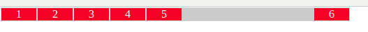
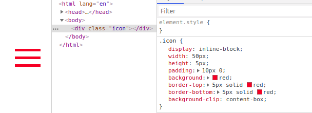
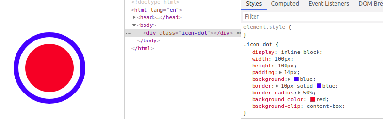

# CSS 的笔记

## CSS 书写顺序

- 1、位置属性(position, top, right, z-index, display, float 等)
- 2、大小(width, height, padding, margin)
- 3、文字系列(font, line-height, letter-spacing, color- text-align 等)
- 4、背景(background, border 等)
- 5、其他(animation, transition 等)

## 常见的盒子垂直并水平居中

1、绝对定位和负边距

html

```html
<div class="parentBox">
  <div class="childBox"></div>
</div>
```

css

```css
.parentBox {
  position: relative;
  /* 针对与relative绝对定位，最好是行级元素（可修改高宽） */
  display: inline-block;
  width: 400px;
  height: 400px;
  background: #ccc;
}
.childBox {
  position: absolute;
  top: 50%;
  left: 50%;
  width: 100px;
  height: 100px;
  margin-top: -50px; /*高度的一半*/
  margin-left: -50px; /*宽度的一半*/
  background: red;
}
```

2、定位与 transform: translate(-50%, -50%);实现
html

```html
<div class="parentBox">
  <div class="childBox"></div>
</div>
```

css

```css
.parentBox {
  position: relative;
  /* 针对与relative绝对定位，最好是行级元素（可修改高宽） */
  display: inline-block;
  width: 400px;
  height: 400px;
  background: #ccc;
}

.childBox {
  position: absolute;
  top: 50%;
  left: 50%;
  width: 100px;
  height: 100px;
  transform: translate(-50%, -50%); /*x和y方向的偏移*/
  background: red;
}
```

3、display: flex/grid 和 margin: auto;配合

html

```html
<div class="parentBox">
  <div class="childBox"></div>
</div>
```

css

```css
.parentBox {
  /* 垂直居中 flex，inline-flex， grid， inline-grid */
  display: flex;
  width: 400px;
  height: 400px;
  background: #ccc;
}

.childBox {
  /* 水平居中 */
  margin: auto;
  width: 100px;
  height: 100px;
  background: red;
}
```

4、display: table-cell 实现

html

```html
<div class="parentBox">
  <div class="childBox"></div>
</div>
```

css

```css
.parentBox {
  /* 核心 */
  display: table-cell;
  vertical-align: middle; /* 垂直居中 */
  width: 400px;
  height: 400px;
  background: #ccc;
}

.childBox {
  width: 100px;
  height: 100px;
  margin: auto; /* 水平居中 */
  background: red;
}

/* 或者 如下方式：*/
.parentBox {
  display: table-cell;
  vertical-align: middle; /* 垂直居中 */
  text-align: center; /* 水平居中 */
  width: 400px;
  height: 400px;
  background: #ccc;
}

.childBox {
  display: inline-block; /* 必须设置 */
  width: 100px;
  height: 100px;
  background: red;
}
```

5、display: flex; justify-content: center; align-items: center;配合

html

```html
<div class="parentBox">
  <div class="childBox"></div>
</div>
```

css

```css
.parentBox {
  display: flex;
  justify-content: center; /* 水平居中 */
  align-items: center; /* 垂直居中 */
  width: 400px;
  height: 400px;
  background: #ccc;
}

.childBox {
  width: 100px;
  height: 100px;
  background: red;
}
```

6、绝对定位、 0 与 margin: auto;配合

html

```html
<div class="parentBox">
  <div class="childBox"></div>
</div>
```

css

```css
.parentBox {
  position: relative;
  display: inline-block; /* 只是为了设置为行内块级元素，不影响居中， 个人一般和position: relative; 一起使用 */
  width: 400px;
  height: 400px;
  background: #ccc;
}

.childBox {
  position: absolute; /* 绝对定位 */
  top: 0; /* 0 */
  left: 0; /* 0 */
  bottom: 0; /* 0 */
  right: 0; /* 0 */
  width: 100px;
  height: 100px;
  margin: auto; /* 垂直、水平居中 */
  background: red;
}
```

7、text-align: center; display:inline-block; 与伪元素， vertical-align: middle; height: 100%; 配合

html

```html
<div class="parentBox">
  <div class="childBox"></div>
</div>
```

css

```css
.parentBox {
  display: inline-block; /* 这里的 display: inline-block; 不影响居中 */
  text-align: center; /* 水平居中 */
  width: 400px;
  height: 400px;
  background: #ccc;
}

.parentBox:after {
  content: "";
  display: inline-block; /* 这里的 display: inline-block; 影响垂直居中 */
  vertical-align: middle; /* 这里的 vertical-align: middle; 必须 与子元素 childBox 中 vertical-align: middle;一起使用 */
  height: 100%; /* 影响垂直居中 */
}

.childBox {
  display: inline-block; /* 这里的 display: inline-block; 影响全部居中 */
  vertical-align: middle;
  width: 100px;
  height: 100px;
  background: red;
}
```

8、display: -webkit-box; -webkit-box-pack: center; -webkit-box-align: center; 配合

html

```html
<div class="parentBox">
  <div class="childBox"></div>
</div>
```

css

```css
.parentBox {
  display: -webkit-box; /* 不适合设置宽度， 高度由内容撑开*/
  -webkit-box-pack: center; /* 水平居中 */
  -webkit-box-align: center; /* 垂直居中 */
  /*
  width: 400px;
  height: 400px;
  */
  background: #ccc;
}

.childBox {
  width: 100px;
  height: 100px;
  background: red;
}
```

## 一层 HTML 结构实现左右布局

> display: flex 与 margin-left: auto; 配合

如图：


html

```html
<div class="items">
  <div class="item">1</div>
  <div class="item">2</div>
  <div class="item">3</div>
  <div class="item">4</div>
  <div class="item">5</div>
  <div class="item">6</div>
</div>
```

css

```css
.items {
  /* display: flex; 核心*/
  display: flex;
  width: 500px;
  margin: 1px;
  text-align: center;
  background: #ccc;
}

.item {
  margin: 1px;
  width: 50px;
  color: #fff;
  background: red;
}

.items > .item:last-child {
  /* 最有一列向右对齐 */
  margin-left: auto;
}
```

## 单个元素实现三条杠

效果：


```html
<style>
  .icon {
    display: inline-block;
    width: 50px;
    height: 5px;
    padding: 10px 0;
    background-color: blue;
    border-top: 5px solid blue;
    border-bottom: 5px solid blue;
    background-clip: content-box;
  }
</style>
<div class="icon"></div>
```

## 单个元素实现实心园

效果：


```html
<style>
  .icon-dot {
    display: inline-block;
    width: 100px;
    height: 100px;
    padding: 10px;
    background: blue;
    border: 10px solid blue;
    border-radius: 50%;
    background-color: currentColor;
    background-clip: content-box;
  }
</style>
<div class="icon-dot"></div>
```
