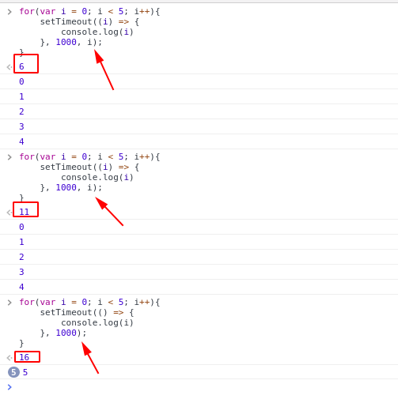
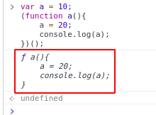
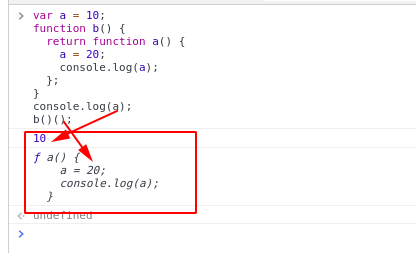
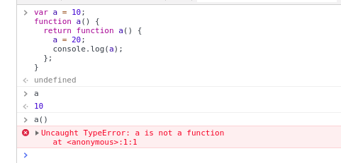

# 易错点

## Nubmer.parseInt(可以转换的数字值, 基数)

```javascript
Number.parseInt("1", 2); // 1
Number.parseInt("1", 36); // 1

Number.parseInt("1", 1); // NaN
Number.parseInt("1", 37); // NaN
Number.parseInt("1", -1); // NaN

// a1 等价于 a2 输入的值都是 [1, NaN, NaN]
let a1 = ["1", "2", "3"].map((i, a) => parseInt(i, a));
let a2 = ["1", "2", "3"].map(parseInt);

// PS:  map 能传进回调函数 3 个参数 (element, index, array)
parseInt('1', 0);  // 0代表10进制
parseInt('2', 1);  // 没有1进制，不合法
parseInt('3', 2);  // 2进制根本不会有3

```

PS: 因此，parseInt 的第二个参数只能是 [2, 36] 的闭区间，才会对可以转换的数字值，进行进制转换。

```javascript
let arr = [1, 2, 3, 4];
let arrA = arr.map(Number.parseInt); // [1, NaN, NaN, NaN]
```

## 闭包

```javascript
for (var i = 0; i < 5; i++) {
  setTimeout(
    i => {
      console.log(i);
    },
    1000,
    i
  );
}

for (var i = 0; i < 5; i++) {
  setTimeout(() => {
    console.log(i);
  }, 1000);
}
```

结果：



```javascript
var a = 10;
(function a() {
  a = 20;
  console.log(a);
})();

var a = 10;
function b() {
  return function a() {
    a = 20;
    console.log(a);
  };
}
b()();
```




```javascript
var a = 10;
function a() {
  return function a() {
    a = 20;
    console.log(a);
  };
}
```

结果：



## null 与 Object

```javascript
console.log(typeof null); // "object"
console.log(null instanceof Object); // false

// PS: null 代表空对象指针, instanceof 判断的实例是否是某个对象的构造函数，显然，null 没有构造函数的

console.log(null == undefined); // true
console.log(null === undefined); // false
```

```javascript
// Goodbye Jack
var name = 'World!';
(function () {
  if (typeof name === 'undefined') {
    var name = 'Jack';
    console.log('Goodbye ' + name);
  } else {
    console.log('Hello ' + name);
  }
})(); // 输出 Goodbye Jack

// Goodbye Jack
var name = 'World!';
(function () {
  if (typeof name === 'undefined') {
    var name = 'Jack';
    console.log('Goodbye ' + name);
  } else {
    console.log('Hello ' + name);
  }
})(name); // 输出 Goodbye Jack

// Hello World
var name = 'World!';
(function (name) {
  if (typeof name === 'undefined') {
    var name = 'Jack';
    console.log('Goodbye ' + name);
  } else {
    console.log('Hello ' + name);
  }
})(name); // 输出 Hello World

```

（1）typeof时 name变量提升。 在函数内部之声明未定义
（2）typeof优先级高于===

[相关链接](https://juejin.im/post/5b1f899fe51d4506c60e46ee "javascript的技巧")
