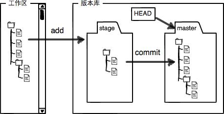

# git 工作流程



说明：

- 工作区就是创建仓库的文件夹如（`notebook` 文件夹就是一个工作区）
- 版本库就是工作区的隐藏目录.git,版本库中有暂存区（stage/index）和分支（master）
- `git add` 实际是把文件添加到暂存区，`git commit` 把暂存区的内容提交到当前分支

## 创建版本库

1. 创建 git 仓库文件夹（工作区）并进入到文件夹（工作区），名为: `notebook`

```shell
mkdir notebook && cd notebook
```

2. 初始化仓库 notebook

```shell
git init
```

3. 工作区添加文件并提交到暂存区

```shell
# 创建文件并添加一些内容
echo "lean git" >> README.md

# 添加到仓库暂存区，在暂存区的文件会变绿
git add README.md   （如果是 “.” 表示修改的文件全部添加到赞存区）

# 提交 README.md 文件到当前分支, -m "提交说明"(只有进行 git add 后 go commit 命令才有效)
git commit -m "add README.md"
```

4. 工作区修改文件

```shell
# 修改完成文件后，执行 git status 查看仓库状态
git status

# 添加到仓库暂存区，并提交到当前分支（这里需要多次的添加到暂存区并提交到当前分支，因为需要不断的修改文件）
git add README.m）
# 提交到当前分支）
git commit -m "modify README.md"
```

5. 撤销修改文件（未提交到分支）

- **当文件在工作区时**，执行撤销命令

```shell
git checkout -- README.md
```

- **当文件在暂存区时**, 首先使文件回到工作区， 再执行撤销命令

```shell
# 使文件返回到工作区
git reset HEAD README.md

# 再执行撤销命令
git checkout -- README.md
```

## 版本控制 （无限次后悔）

> 在 Git 中， HEAD 表示当前版本库， HEAD^ 表示上一个版本库， HEAD^^ 表示上一个的上一个版本库

1. 查看提交的完整日志

```shell
  git log
```

2. 查看提交的简要日志

```shell
git log --pretty=noline
```

3. 返回到上一个版本库

```shell
git reset --hard HEAD^
```

4. 回到指定版本（hard 后面添加版本号 一般 7 位）

```shell
git reset --hard ae34256
```

5. 查看命令历史

```shell
git reflog
```

## 远程仓库

这里需要在 github 上注册一下有才可继续接下来的学习......

1. 在注册好的 github 上新建一个名为和本地名称一样的空的仓库`notebook`
2. 在本地工作空间 `notebook` 目录下执行如下命令：

```shell
# lyios8859-1 就是注册时的名称 （ssh和https的方式）
git remote add origin git@github.com:lyios8859-1/notebook.git   [https://github.com/lyios8859-1/notebook.git]
```

3.把本地内容推送到 github 远程仓库上(第一次 push 必须带参数 -u 关联远程仓库)

```shell
git push -u origin master（master 可以是其他分支）
```

PS:此时，如果报错： 证明电脑没有修改远程仓库的公钥

```shell
Permission denied (publickey).
fatal: Could not read from remote repository.

Please make sure you have the correct access rights
and the repository exists.
```

> 解决方法：
>
> 1. 在 github 上点击头像下拉框的 Settings --> SSH and GPG keys --> new SSH key 添加 SHH 公钥
> 2. 打开 id_rsa.pub 文件（windows 用户在 C:/Users/Administrator/.ssh/id.rsa.pub， Linux 用户在 root 在 /root/.ssh/ 下，普通用户是/home/您的用户名/.ssh/ 下。[参考](<(https://blog.csdn.net/nahancy/article/details/79059135)> "CSDN 文章")
> 3. 将 id_rsa.pub 文件内容拷贝到 key 就可以了，title 任意。

## 克隆远程仓库到本地

```shell
# （ssh和https的方式）
git clone git@github.com:lyios8859-1/notebook.git  [https://github.com/lyios8859-1/notebook.git]
```

1. 拉取项目（从远程仓库更新本地仓库，前提是已关联）

```shell
git pull origin master （master 可以是其他分支）
```
