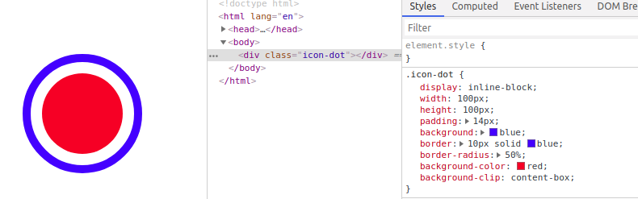

# CSS 的笔记

## CSS 书写顺序

- 1、位置属性(position, top, right, z-index, display, float 等)
- 2、大小(width, height, padding, margin)
- 3、文字系列(font, line-height, letter-spacing, color- text-align 等)
- 4、背景(background, border 等)
- 5、其他(animation, transition 等)

## 常见的盒子垂直并水平居中

1、绝对定位和负边距

html

```html
<div class="parentBox">
  <div class="childBox"></div>
</div>
```

css

```css
.parentBox {
  position: relative;
  /* 针对与relative绝对定位，最好是行级元素（可修改高宽） */
  display: inline-block;
  width: 400px;
  height: 400px;
  background: #ccc;
}
.childBox {
  position: absolute;
  top: 50%;
  left: 50%;
  width: 100px;
  height: 100px;
  margin-top: -50px; /*高度的一半*/
  margin-left: -50px; /*宽度的一半*/
  background: red;
}
```

2、定位与 transform: translate(-50%, -50%);实现
html

```html
<div class="parentBox">
  <div class="childBox"></div>
</div>
```

css

```css
.parentBox {
  position: relative;
  /* 针对与relative绝对定位，最好是行级元素（可修改高宽） */
  display: inline-block;
  width: 400px;
  height: 400px;
  background: #ccc;
}

.childBox {
  position: absolute;
  top: 50%;
  left: 50%;
  width: 100px;
  height: 100px;
  transform: translate(-50%, -50%); /*x和y方向的偏移*/
  background: red;
}
```

3、display: flex/grid 和 margin: auto;配合

html

```html
<div class="parentBox">
  <div class="childBox"></div>
</div>
```

css

```css
.parentBox {
  /* 垂直居中 flex，inline-flex， grid， inline-grid */
  display: flex;
  width: 400px;
  height: 400px;
  background: #ccc;
}

.childBox {
  /* 水平居中 */
  margin: auto;
  width: 100px;
  height: 100px;
  background: red;
}
```

4、display: table-cell 实现

html

```html
<div class="parentBox">
  <div class="childBox"></div>
</div>
```

css

```css
.parentBox {
  /* 核心 */
  display: table-cell;
  vertical-align: middle; /* 垂直居中 */
  width: 400px;
  height: 400px;
  background: #ccc;
}

.childBox {
  width: 100px;
  height: 100px;
  margin: auto; /* 水平居中 */
  background: red;
}

/* 或者 如下方式：*/
.parentBox {
  display: table-cell;
  vertical-align: middle; /* 垂直居中 */
  text-align: center; /* 水平居中 */
  width: 400px;
  height: 400px;
  background: #ccc;
}

.childBox {
  display: inline-block; /* 必须设置 */
  width: 100px;
  height: 100px;
  background: red;
}
```

5、display: flex; justify-content: center; align-items: center;配合

html

```html
<div class="parentBox">
  <div class="childBox"></div>
</div>
```

css

```css
.parentBox {
  display: flex;
  justify-content: center; /* 水平居中 */
  align-items: center; /* 垂直居中 */
  width: 400px;
  height: 400px;
  background: #ccc;
}

.childBox {
  width: 100px;
  height: 100px;
  background: red;
}
```

6、绝对定位、 0 与 margin: auto;配合

html

```html
<div class="parentBox">
  <div class="childBox"></div>
</div>
```

css

```css
.parentBox {
  position: relative;
  display: inline-block; /* 只是为了设置为行内块级元素，不影响居中， 个人一般和position: relative; 一起使用 */
  width: 400px;
  height: 400px;
  background: #ccc;
}

.childBox {
  position: absolute; /* 绝对定位 */
  top: 0; /* 0 */
  left: 0; /* 0 */
  bottom: 0; /* 0 */
  right: 0; /* 0 */
  width: 100px;
  height: 100px;
  margin: auto; /* 垂直、水平居中 */
  background: red;
}
```

7、text-align: center; display:inline-block; 与伪元素， vertical-align: middle; height: 100%; 配合

html

```html
<div class="parentBox">
  <div class="childBox"></div>
</div>
```

css

```css
.parentBox {
  display: inline-block; /* 这里的 display: inline-block; 不影响居中 */
  text-align: center; /* 水平居中 */
  width: 400px;
  height: 400px;
  background: #ccc;
}

.parentBox:after {
  content: "";
  display: inline-block; /* 这里的 display: inline-block; 影响垂直居中 */
  vertical-align: middle; /* 这里的 vertical-align: middle; 必须 与子元素 childBox 中 vertical-align: middle;一起使用 */
  height: 100%; /* 影响垂直居中 */
}

.childBox {
  display: inline-block; /* 这里的 display: inline-block; 影响全部居中 */
  vertical-align: middle;
  width: 100px;
  height: 100px;
  background: red;
}
```

8、display: -webkit-box; -webkit-box-pack: center; -webkit-box-align: center; 配合

html

```html
<div class="parentBox">
  <div class="childBox"></div>
</div>
```

css

```css
.parentBox {
  display: -webkit-box; /* 不适合设置宽度， 高度由内容撑开*/
  -webkit-box-pack: center; /* 水平居中 */
  -webkit-box-align: center; /* 垂直居中 */
  /*
  width: 400px;
  height: 400px;
  */
  background: #ccc;
}

.childBox {
  width: 100px;
  height: 100px;
  background: red;
}
```

## 一层 HTML 结构实现左右布局

> display: flex 与 margin-left: auto; 配合

如图：


html

```html
<div class="items">
  <div class="item">1</div>
  <div class="item">2</div>
  <div class="item">3</div>
  <div class="item">4</div>
  <div class="item">5</div>
  <div class="item">6</div>
</div>
```

css

```css
.items {
  /* display: flex; 核心*/
  display: flex;
  width: 500px;
  margin: 1px;
  text-align: center;
  background: #ccc;
}

.item {
  margin: 1px;
  width: 50px;
  color: #fff;
  background: red;
}

.items > .item:last-child {
  /* 最有一列向右对齐 */
  margin-left: auto;
}
```

## 单个元素实现三条杠

效果：


```html

<style>
  /*方案一*/
  .icon {
    display: inline-block;
    width: 50px;
    height: 5px;
    padding: 10px 0;
    background-color: blue;
    border-top: 5px solid blue;
    border-bottom: 5px solid blue;
    background-clip: content-box;
  }

  /*方案二*/
  .icon {
    display: inline-block;
    width: 20px;
    border-top: 12px double;
    border-bottom: 4px solid;
    padding: 2px;display: inline-block;
    width: 20px;
    border-top: 12px double;
    border-bottom: 4px solid;
    padding: 2px;
  }

  /*方案三*/
  .icon {
    display: inline-block;
    width: 20px;
    height: 4px;
    border-top: 12px double;
    border-bottom: 4px solid;
  }

```

## 单个元素实现实心园

效果：


```html
<style>
  .icon-dot {
    display: inline-block;
    width: 100px;
    height: 100px;
    padding: 10px;
    background: blue;
    border: 10px solid blue;
    border-radius: 50%;
    background-color: currentColor;
    background-clip: content-box;
  }
</style>
<div class="icon-dot"></div>
```

## CSS3 的 `：not(el)`

> 排除某个元素 el

最后一个 li 排除，不添加 border

```html
<style>
/*一般做法*/
ul li {
  border: 1px solid #666;
}
ul li:last-child {
  border: none;
}

/*高级的做法*/
ul li:not(:last-child) {
  border: 1px solid #666;
}

/*添加逗号*/
ul > li:not(:last-child)::after { 
  content: ",";
}
</style>

<ul>
  <li>1</li>
  <li>2</li>
  <li>3</li>
  <li>4</li>
  <li>5</li>
</ul>


```

## 黑白图像

```html
<style>
img {
  filter: grayscale(100%);
  -webkit-filter: grayscale(100%);
  -moz-filter: grayscale(100%);
  -ms-filter: grayscale(100%);
  -o-filter: grayscale(100%);
}
</style>
```

## 页面顶部阴影

```html
<style>
body:before {
  content: "";
  position: fixed;
  top: -10px;
  left: 0;
  width: 100%;
  height: 10px;
  -webkit-box-shadow: 0px 0px 10px rgba(0, 0, 0, .8);
  -moz-box-shadow: 0px 0px 10px rgba(0, 0, 0, .8);
  box-shadow: 0px 0px 10px rgba(0, 0, 0, .8);
  z-index: 100;
}
</style>
```


## 三条杠和叉叉的切换

```html
<style>
.father {
  position: relative;
  width: 600px;
  height: 400px;
  background: #ccc;
}
.son {
  position: absolute;
  top: 0;
  left: 0;
  bottom: 0;
  right: 0;
  width: 200px;
  height: 100px;
  background: red;
  margin: auto;
}

.icon-menu {
  display: inline-block;
  width: 24px;
  height: 4px;
  border-top: 14px double;
  border-bottom: 5px solid;
}
.icon-close {
  position: relative;
  width: 24px;
  height: 24px;
}
/* .icon-close::before, .icon-close::after {
  position: absolute;
  left: 10px;
  content: ' ';
  height: 25px;
  width: 4px;
  background: black;
}
.icon-close::before {
  transform: rotate(45deg);
}
.icon-close::after {
  transform: rotate(-45deg);
} */
.icon-close::after {
  content: '\2716';
  font-size: 26px;
  text-align: center;
  line-height: 24px;
  color: black;
}
</style>
<div class="father">
<div class="son">
</div>
</div>

<span class="icon-close" id="icon"></span>
<script>
const iconDom = document.querySelector('#icon');
iconDom.onclick = function (ev) {
if (ev.target.classList.contains('icon-close')) {
  ev.target.classList.replace('icon-close', 'icon-menu');
} else if (ev.target.classList.contains('icon-menu')) {
  ev.target.classList.replace('icon-menu', 'icon-close');
}
}
</script>
```