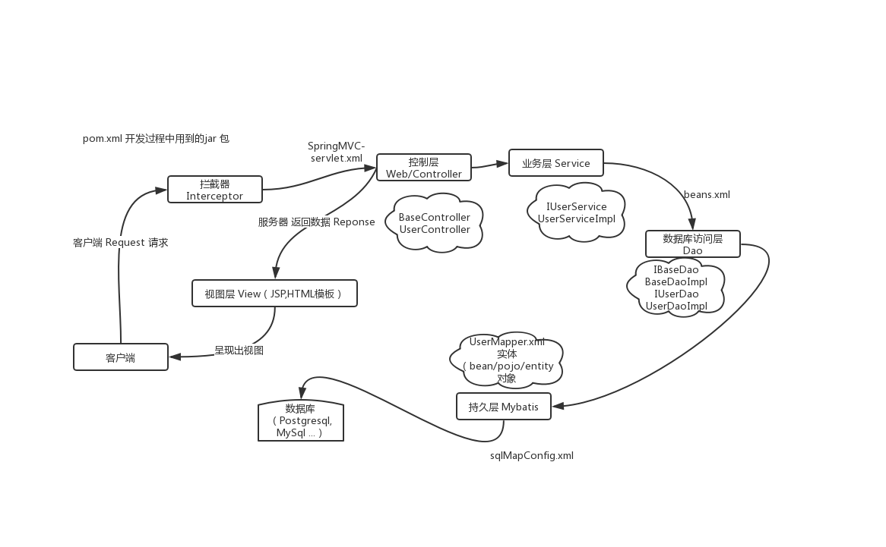

# Spring + SpringMVC + Mybatis + Maven 框架整合

> Maven 3.6.1 + Spring 4.0.2 RELEASE + Spring MVC 4.0.2 RELEASE + MyBatis 3.2.6

- mvn compile 编译,将Java 源程序编译成 class 字节码文件。
- mvn test 测试，并生成测试报告
- mvn clean 将以前编译得到的旧的 class 字节码文件删除
- mvn pakage 打包,动态 web工程打 war包，Java工程打 jar 包。
- mvn install 将项目生成 jar 包放在仓库中，以便别的模块调用

## 流程

1、将 Mybatis 与 Spring 整合， 为了通过 Spring 来创建 mapper 对象，调用对应的 mapper 接口；
2、将业务层与数据层整合，a：service接口中可以调用mapper， b：事物控制；
3、控制层与业务层整合，a：action（Web）中调用service，b：将 service 中的数据拿出在视图层展示即可。




## Maven

修改默认的jar包（本地仓库）到指定的存放位置， 找到 `conf` 文件夹中的 `settings.xml` 文件

```xml
<!-- <localRepository>存放路径</localRepository> -->
<localRepository>/home/timly/Desktop/install/java/repository</localRepository>
```

## pom.xml

> 管理 jar 包

```xml
<project xmlns="http://maven.apache.org/POM/4.0.0" xmlns:xsi="http://www.w3.org/2001/XMLSchema-instance" xsi:schemaLocation="http://maven.apache.org/POM/4.0.0 http://maven.apache.org/maven-v4_0_0.xsd">
  <modelVersion>4.0.0</modelVersion>
  <groupId>com.tom.mavenssm</groupId>
  <artifactId>mavenssm</artifactId>
  <packaging>war</packaging>
  <version>0.0.1-SNAPSHOT</version>
  <name>ssm Maven Webapp</name>
  <url>http://github.com/lyios8859-1/notebook/ssm</url>
  <properties>
    <!-- spring版本号 -->
    <spring.version>4.0.2.RELEASE</spring.version>
    <!-- mybatis版本号 -->
    <mybatis.version>3.2.6</mybatis.version>
    <!-- log4j日志文件管理包版本 -->
    <slf4j.version>1.7.7</slf4j.version>
    <log4j.version>1.2.17</log4j.version>

    <!-- maven 解决默认编码是GBK警告 -->
    <project.build.sourceEncoding>UTF-8</project.build.sourceEncoding>
    <project.reporting.outputEncoding>UTF-8</project.reporting.outputEncoding>
  </properties>

  <dependencies>
    <!-- junit 单元测试 -->
    <dependency>
      <groupId>junit</groupId>
      <artifactId>junit</artifactId>
      <!-- 默认3.18，不支持注入 -->
      <version>4.12</version>
      <scope>test</scope>
    </dependency>
  </dependencies>
</project>
```

## spring

- 第一步：先在spring文件夹里新建 `spring-dao.xml` 文件，因为 `spring` 的配置太多，分三层处理比较清晰，分别是 `dao service web(controller)`。
  - 读入数据库连接相关参数（可选）
  - 配置数据连接池
  - 配置连接属性，可以不读配置项文件直接在这里写死
  - 配置 c3p0，只配了几个常用的
  - 配置 `SqlSessionFactory` 对象（mybatis）
  - 扫描 dao 层接口，动态实现 dao 接口，也就是说不需要 daoImpl，sql 和参数都写在 xml 文件上

## SpringMVC

> Web（Controller） 层

```xml
<?xml version="1.0" encoding="UTF-8"?>
<beans xmlns="http://www.springframework.org/schema/beans"
  xmlns:context="http://www.springframework.org/schema/context" xmlns:p="http://www.springframework.org/schema/p"
  xmlns:aop="http://www.springframework.org/schema/aop" xmlns:tx="http://www.springframework.org/schema/tx"
  xmlns:xsi="http://www.w3.org/2001/XMLSchema-instance"
  xsi:schemaLocation="http://www.springframework.org/schema/beans http://www.springframework.org/schema/beans/spring-beans-4.0.xsd
  http://www.springframework.org/schema/context http://www.springframework.org/schema/context/spring-context-4.0.xsd
  http://www.springframework.org/schema/aop http://www.springframework.org/schema/aop/spring-aop-4.0.xsd http://www.springframework.org/schema/tx http://www.springframework.org/schema/tx/spring-tx-4.0.xsd
  http://www.springframework.org/schema/util http://www.springframework.org/schema/util/spring-util-4.0.xsd">
  
  <!-- 自动扫描  @Controller  (web层)-->
  <context:component-scan base-package="com.tom.controller"/>

  <!--避免IE执行AJAX时，返回JSON出现下载文件 -->
  <bean id="mappingJacksonHttpMessageConverter" class="org.springframework.http.converter.json.MappingJacksonHttpMessageConverter">
    <property name="supportedMediaTypes">
      <list>
        <value>text/html;charset=UTF-8</value>
      </list>
    </property>
  </bean>
  
  <!-- 启动SpringMVC的注解功能，完成请求和注解POJO的映射 -->
  <bean class="org.springframework.web.servlet.mvc.annotation.AnnotationMethodHandlerAdapter">
    <property name="messageConverters">
      <list>
        <ref bean="mappingJacksonHttpMessageConverter" /> <!-- JSON转换器 -->
      </list>
    </property>
  </bean>

  <!-- 配置文件上传，如果没有使用文件上传可以不用配置，当然如果不配，那么配置文件中也不必引入上传组件包 -->
  <bean id="multipartResolver" class="org.springframework.web.multipart.commons.CommonsMultipartResolver">
    <!-- 默认编码 -->
    <property name="defaultEncoding" value="utf-8" />
    <!-- 文件大小最大值 -->
    <property name="maxUploadSize" value="10485760000" />
    <!-- 内存中的最大值 -->
    <property name="maxInMemorySize" value="40960" />
  </bean>

  <!-- 定义跳转的文件的前后缀 ，视图模式配置 -->
  <bean class="org.springframework.web.servlet.view.InternalResourceViewResolver">
    <property name="prefix" value="/WEB-INF/jsp/" />
    <property name="suffix" value=".jsp"/>
  </bean>
</beans>
```

## Mybatis

> 数据持久层（Dao）

```xml
<?xml version="1.0" encoding="UTF-8"?>
<beans xmlns="http://www.springframework.org/schema/beans"
  xmlns:context="http://www.springframework.org/schema/context" xmlns:p="http://www.springframework.org/schema/p"
  xmlns:aop="http://www.springframework.org/schema/aop" xmlns:tx="http://www.springframework.org/schema/tx"
  xmlns:xsi="http://www.w3.org/2001/XMLSchema-instance"
  xsi:schemaLocation="http://www.springframework.org/schema/beans http://www.springframework.org/schema/beans/spring-beans-4.0.xsd
  http://www.springframework.org/schema/context http://www.springframework.org/schema/context/spring-context-4.0.xsd
  http://www.springframework.org/schema/aop http://www.springframework.org/schema/aop/spring-aop-4.0.xsd http://www.springframework.org/schema/tx http://www.springframework.org/schema/tx/spring-tx-4.0.xsd
  http://www.springframework.org/schema/util http://www.springframework.org/schema/util/spring-util-4.0.xsd">
  
  <!-- 自动扫描 -->
  <context:component-scan base-package="com.tom.*" />

  <!--加载配置文件-->
  <bean id="propertyConfigurer" class="org.springframework.beans.factory.config.PropertyPlaceholderConfigurer">
    <property name="location" value="classpath:properties/jdbc.properties"/>
  </bean>

  <!-- 配置数据库连接池 -->
  <!-- <bean id="dataSource" class="org.apache.commons.dbcp.BasicDataSource" destroy-method="close"> -->
  <bean id="dataSource" class="com.alibaba.druid.pool.DruidDataSource" destroy-method="close">
    <property name="driverClassName" value="${jdbc.driver}"/>
    <property name="url" value="${jdbc.url}"/>
    <property name="username" value="${jdbc.username}"/>
    <property name="password" value="${jdbc.password}"/>
    <!-- 初始化连接大小 -->
    <property name="initialSize" value="${initialSize}"></property>
    <!-- 连接池最大数量 -->
    <property name="maxActive" value="${maxActive}"></property>
    <!-- 连接池最大空闲 -->
    <property name="maxIdle" value="${maxIdle}"></property>
    <!-- 连接池最小空闲 -->
    <property name="minIdle" value="${minIdle}"></property>
    <!-- 获取连接最大等待时间 -->
    <property name="maxWait" value="${maxWait}"></property>
  </bean>

  <!-- spring和MyBatis完美整合，不需要mybatis的配置映射文件，让spring管理sqlsessionfactory  -->
  <bean id="sqlSessionFactory" class="org.mybatis.spring.SqlSessionFactoryBean">
    <property name="dataSource" ref="dataSource" />
    <!-- 自动扫描*mapping.xml文件 -->
    <property name="mapperLocations" value="classpath*:com/tom/mapper/**/*.xml"></property>
    <!-- 加载mybatis的全局配置文件 -->
    <!-- <property name="configLocation" value="classpath:mybatis/SqlMapConfig.xml" /> -->
  </bean>

  <!-- DAO接口所在包名，Spring会自动查找其下的类，将Mapper接口生成代理注入到Spring  -->
  <bean class="org.mybatis.spring.mapper.MapperScannerConfigurer">
    <property name="basePackage" value="com.tom.dao" />
    <!-- <property name="sqlSessionFactoryBeanName" value="sqlSessionFactory"></property> -->
  </bean>
</beans>
```

### UserMapper.xml

> 操作数据源

```xml
<?xml version="1.0" encoding="UTF-8"?>
<!DOCTYPE mapper PUBLIC "-//mybatis.org/DTD Mapper 3.0" "http://mybatis.org/dtd/mybatis-3-mapper.dtd">
<!--namespace: 必须和接口的全类名一致 （全类名=包名+类名） -->
<mapper namespace="com.tom.dao.IUserDao">
  <!-- id: 与接口 IUserDao 中的方法相同 -->
  <select id="selectAllUserInfo" resultType="com.tom.bean.User">
    <!-- name， createTime 与实体（User）中的属性相同 -->
    select name, create_time as createTime from ly_user;
  </select>
</mapper>
```

### 测试

```shell
# 在 pom.xml 所在文件下执行 mvn 命令
mvn test
```

PS: mvn test 测试时候不能有注释
