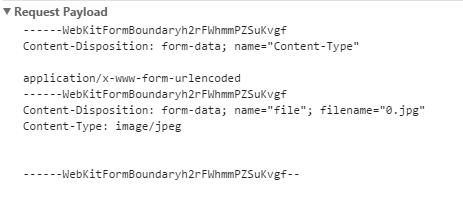

# 关于Content-Type中application/x-www-form-urlencoded 和 multipart/form-data的区别及用法

- 表单

> 在Form元素的语法中，EncType表明提交数据的格式使用用 Enctype 属性指定将数据回发到服务器时浏览器使用的编码类型.

例如：

`application/x-www-form-urlencoded`： 窗体数据被编码为(名称/值对),标准的编码格式.
`multipart/form-data`： 窗体数据被编码为一条消息,页上的每个控件对应消息中的一个部分,这个一般文件上传时用.
`text/plain`： 窗体数据以纯文本形式进行编码,其中不含任何控件或格式字符.

- 常用的编码方式

form的enctype属性为编码方式，常用有两种： 默认为 `application/x-www-form-urlencoded`.
1, `application/x-www-form-urlencoded`: 当action为get时候，浏览器用x-www-form-urlencoded的编码方式把form数据转换成一个字串（name1=value1&name2=value2…），然后把这个字串append到url后面，用?分割，加载这个新的url。

2, `multipart/form-data`: 当action为post时候，浏览器把form数据封装到http body中，然后发送到server。 如果没有type=file的控件，用默认的application/x-www-form-urlencoded就可以了。 但是如果有type=file的话，就要用到multipart/form-data了。浏览器会把整个表单以控件为单位分割，并为每个部分加上Content-Disposition(form-data或者file),Content-Type(默认为text/plain),name(控件name)等信息，并加上分割符(boundary)。

每一段------WebKitFormBoundaryh2rFWhmmPZSuKvgf--为对应一部分消息

`enctype="multipart/form-data"`是上传二进制数据; 它告诉我们传输的数据要用到多媒体传输协议, 由于多媒体传输的都是大量的数据，所以规定上传文件必须是post方法，\<input>的type属性必须是file。form里面的input的值以2进制的方式传过去(发送给服务器).
