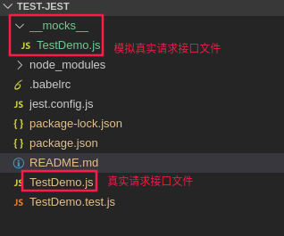

# Jest 前端测试

## 原理

math.js 文件

```js
function add (a, b) {
  return a * b;
}

function minus (a, b) {
  return a - b;
}

function multi (a, b) {
  return a * b;
}

function division (a, b) {
  return a / b;
}

// commjs规范
module.exports = {
  add,
  minus,
  multi,
  division
}
```

math.test.js 测试文件

```js
// commjs规范 （node就是符合commjs规范）
const { add, minus, multi, division } = require('./math.js');

const addResult = add(1, 4);
const addExpected = 5;

if ( addResult !== 5) {
  throw Error(`1 + 4 应该等于${addExpected}，但是结果却是${addResult}`)
} else {
  console.log('add 方法测试通过。')
}

const minusResult = minus(1, 4);
const minusExpected = -3;

if ( minusResult !== -3) {
  throw Error(`1 - 4 应该等于${minusExpected}，但是结果却是${minusResult}`)
} else {
  console.log('minus 方法测试通过。')
}

const multiResult = multi(1, 4);
const multiExpected = 4;

if ( multiResult !== 4) {
  throw Error(`1 * 4 应该等于${multiExpected}，但是结果却是${multiResult}`)
} else {
  console.log('multi 方法测试通过。')
}

const divisionResult = division(2, 4);
const divisionExpected = 0.5;

if ( divisionResult !== 0.5) {
  throw Error(`2 / 4 应该等于${divisionExpected}，但是结果却是${divisionResult}`)
} else {
  console.log('division 方法测试通过。')
}

```

**优化一下**

```js
const { add, minus, multi, division } = require('./math.js');

function expect (result) {
  return {
    toBe: function (actual) {
      if ( result !== actual) {
        throw Error(`预期值与实际值不相等, 预期值${actual}, 结果却是${result}`)
      }
    }
  }
}

function test (desc, fn) {
  try {
    fn && fn();
    console.log(`${desc}，测试通过。`)
  } catch (e) {
    console.log(`${desc}, 测试不通过。${e}`)
  }
}

test('测试加法add, 1 + 4', function () {
  expect(add(1, 4)).toBe(5);
});

test('测试减法minus, 1 - 4', function () {
  expect(minus(1, 4)).toBe(-3);
});

test('测试乘法mutil, 1 * 4', function () {
  expect(multi(1, 4)).toBe(4);
});

test('测试除法division, 2 * 4', function () {
  expect(division(2, 4)).toBe(0.5);
});
```

运行 math.test.js

```shell
node math.test.js
```

是不是非常像测试框架的结构了 :sparkles:

常见测试框架有：Mocha + Chai 配合使用; Jest; Jasmine

## Jest 使用

```shell
npm install --save-dev jest
```

math.test.js 文件内容：

```js
// commonjs 规范
const { add, minus, multi, division } = require('./math.js');

test('测试加法add, 1 + 4', function () {
  expect(add(1, 4)).toBe(5);
});

test('测试减法minus, 1 - 4', function () {
  expect(minus(1, 4)).toBe(-3);
});

test('测试乘法mutil, 1 * 4', function () {
  expect(multi(1, 4)).toBe(4);
});

test('测试除法, 2 * 4', function () {
  expect(division(2, 4)).toBe(0.5);
});
```

运行math.test.js文件

```shell
npx jest math.test.js 
```

生成测试覆盖文件信息, 默认在 coverage 文件夹下

```shell
npx jest --coverage math.test.js
```

**支持 ES Module 方式导入**

math.js文件内容

```js
function add (a, b) {
  return a - b;
}

function minus (a, b) {
  return a - b;
}

function multi (a, b) {
  return a * b;
}

function division (a, b) {
  return a / b;
}
// ES6 规范
export {
  add,
  minus,
  multi,
  division
}
```

math.test.js 文件内容:

```js
// ES6 规范
import { add, minus, multi, division } from './math.js';

test('测试加法add, 1 + 4', function () {
  expect(add(1, 4)).toBe(5);
});

test('测试减法minus, 1 - 4', function () {
  expect(minus(1, 4)).toBe(-3);
});

test('测试乘法mutil, 1 * 4', function () {
  expect(multi(1, 4)).toBe(4);
});

test('测试除法, 2 * 4', function () {
  expect(division(2, 4)).toBe(0.5);
});
```

安装支持 ES 模块的支持插件

```shell
npm i -D @babel/core@7.4.5 @babel/preset-env@7.4.5 
```

创建 ES模块的 .babelrc 配置文件

```json
{
  "presets": [
    [
      "@babel/preset-env", {
        "targets": {
          "node": "current"
        }
      }
    ]
  ]
}
```

```shell
# jest 会自动检测文件 .babelrc 文件进行语法转换
npx jest math.test.js
```

PS:  如果需要对 Jest 进行配置，运行 `npx jest --init`，会生成jest.config.js文件


## 自动检测文件变化自动进行测试

```shell
# 默认修改一个文件的内容会测试所有文件的测试用例
npx jest --watchAll

# 默认修改那个文件就对那个文件的所有测试用例进行测试
npx jest --watch
```

## Jest 常用的匹配器

1. toEqual() 判断对象
2. toBe() 判断非对象
3. toBeNull() 判断 null
4. toBeUndefined() 判断 undefined
5. toBeDefined() 判断是否定义的变量
6. toBeTruthy() 判断为真
7. toBeFalsy() 判断为假
8. toBeGreaterThan() 判断是否大于
9. toBeLessThan() 判断是否小于
10. toBeGreaterThanOrEqual() 判断是否大于等于
11. toBeLessThanOrEqual 判断是否小于等于
12. toBeCloseTo() 注意：0.1 + 0.2 通过 toEqual() 判断是不能测试通过的，所以使用toBeCloseTo()
13. toContain() 判断是否在数组中
14. toMath() 可以使用正则，判断是否在字符串中

## Jest 的命令工具 查文档

## Jest 异步代码测试

- 异步返回数据

fetchData.js 

```js
import axios from 'axios';

function fetchDatas (callback) {
  const url = 'http://localhost:8080/api/test.json'
  axios.get(url).then(function(response) {
    callback && callback(response.data);
  })
}

export {
  fetchDatas
};
```

fetchData.test.js

```js
import { fetchDatas } from './fetchData.js';

test('结果应该：{success: true}', (done) => {
  fetchDatas(data => {
    expect(data).toEqual({success: true});
    done();
  });
});
```

PS: 多了一个参数 done，执行done()函数，表示等数据请求回来才才进行下一步测试

- 异步返回 Promise 对象 

1. 方案一

fetchData.js 

```js
import axios from 'axios';

function fetchDatas (callback) {
  const url = 'http://localhost:8080/api/test.json'
  return axios.get(url);
}

export {
  fetchDatas
};
```

fetchData.test.js

```js
import { fetchDatas } from './fetchData.js';

test('结果应该：{success: true}', () => {
  return fetchDatas().then((response => {
    expect(response.data).toEqual({success: true});
  }));
});
```

PS: 如果有 catch，`expect.assertions(1);` 这里的数字 `1` 表示会执行 一次expect，如果是数字 n 个， 表示expect有几个就有expect也要执行（n与expect个数一致）
fetchData.js 

```js
import axios from 'axios';

function fetchDatas (callback) {
  const url = 'http://localhost:8080/api/test1.json' // 不存在的地址，才能通过
  return axios.get(url);
}

export {
  fetchDatas
};
```

fetchData.test.js

```js
import { fetchDatas } from './fetchData.js';

test('结果应该返回了 404', () => {
  expect.assertions(1);
  return fetchDatas().catch((err => {
    // expect(err.message.indexOf('404') > -1).toBe(true);
    expect(err.toString().indexOf('404') > -1).toBe(true);
  }));
});
```

1. 方案二


```js
import { fetchDatas } from './fetchData.js';

// 成功返回
test('结果应该返回：{success: true}', () => {
  return expect(fetchDatas()).resolves.toMatchObject({
    data: {
      success: true
    }
  });
});
// 或者 使用 ES6 语法
test('结果应该返回：{success: true}', async () => {
  await expect(fetchDatas()).resolves.toMatchObject({
    data: {
      success: true
    }
  });
});

// 请求路径不存在，返回 404
test('结果应该返回：404', () => {
  return expect(fetchDatas()).rejects.toThrow();
});
// 或者 使用 ES6 语法
test('结果应该返回：404', async () => {
  await expect(fetchDatas()).rejects.toThrow();
});
```

## Jest 中的钩子函数

Counter.js

```js
class Counter {
  constructor () {
    this.number = 0;
  }

  add () {
    this.number +=1;
  }

  minus () {
    this.number -=1;
  }
}

export default Counter;
```

Counter.test.js

```js
import Counter from './Counter.js';

let counter = null;

beforeAll(() => {
  counter = new Counter();
  console.log('beforeAll');
});

beforeEach(() => {
  console.log('beforeEach, 所有的测试实例之前都执行该钩子函数');
})

afterAll(() => {
  counter = null;
  console.log('afterAll');
});

test('测试 Counter 中的 add 方法', () => {
  counter.add();
  expect(counter.number).toBe(1);
  console.log('测试 Counter 中的 add 方法');
});

test('测试 Counter 中的 minus 方法', () => {
  counter.minus();
  expect(counter.number).toBe(0);
  console.log('测试 Counter 中的 minus 方法');
});
```

PS: 这里的 add，minus 都影响同一个变量的值，这是我们不愿看到的。如下，`beforeEach` 解决。

```js
import Counter from './Counter.js';

let counter = null;

beforeEach(() => {
  counter = new Counter(); // 每个测试用例之前都先创建一个新的实例
  console.log('beforeEach, 所有的测试实例之前都先执行该钩子函数');
})

afterEach(() => {
  counter = null;
  console.log('afterEach, 所有的测试实例之后都先执行该钩子函数');
});

test('测试 Counter 中的 add 方法', () => {
  counter.add(); // 每个测试用例之后都先创建一个新的实例
  expect(counter.number).toBe(1);
  console.log('测试 Counter 中的 add 方法');
});

test('测试 Counter 中的 minus 方法', () => {
  counter.minus();
  expect(counter.number).toBe(-1);
  console.log('测试 Counter 中的 minus 方法');
});
```
- Jest describe 分组测试

Counter.js

```js
class Counter {
  constructor () {
    this.number = 0;
  }

  add1 () {
    this.number +=1;
  }
  add2 () {
    this.number +=1;
  }

  minus1 () {
    this.number -=1;
  }

  minus2 () {
    this.number -=1;
  }
}

export default Counter;
```

Counter.test.js

```js
import Counter from './Counter.js';

// 理解为分组测试
describe('测试 Counter 类的相关函数', () => {
  let counter = null;

  beforeEach(() => {
    counter = new Counter(); // 每个测试用例之前都先创建一个新的实例
    // console.log('beforeEach, 所有的测试实例之前都先执行该钩子函数');
  })

  afterEach(() => {
    counter = null;
    // console.log('afterEach, 所有的测试实例之后都先执行该钩子函数');
  });

  describe('测试加法相关的函数', () => {
    test('测试 Counter 中的 add1 方法', () => {
      counter.add1(); // 每个测试用例之后都先创建一个新的实例
      expect(counter.number).toBe(1);
      // console.log('测试 Counter 中的 add 方法');
    });

    test('测试 Counter 中的 add2 方法', () => {
      counter.add2(); // 每个测试用例之后都先创建一个新的实例
      expect(counter.number).toBe(1);
      // console.log('测试 Counter 中的 add 方法');
    });
  });

  describe('测试减法相关的函数', () => {
    test('测试 Counter 中的 minus1 方法', () => {
      counter.minus1();
      expect(counter.number).toBe(-1);
      // console.log('测试 Counter 中的 minus 方法');
    });

    test('测试 Counter 中的 minus2 方法', () => {
      counter.minus2();
      expect(counter.number).toBe(-1);
      // console.log('测试 Counter 中的 minus 方法');
    });
  });
});
```

PS：如果忽略其他测试用例，使用 `test.only()`

```js
test.only('测试 Counter 中的 add2 方法', () => {
  counter.add2(); // 每个测试用例之后都先创建一个新的实例
  expect(counter.number).toBe(1);
  // console.log('测试 Counter 中的 add 方法');
});
```

## Jest 中的 Mock 测试回调函数

```js
function ly (callback) {
  callback && callback();
}

export {
  ly
};

// 测试
import { ly } from './TestDemo.js';

test('测试回调函数执行', () => {
  const func = jest.fn(); // Jest 生成一个Mock函数
  ly(func); // 运行自己的回调函数
  expect(func).toBeCalled();
});
```

测试回调函数返回的参数值

```js

function ly (callback) {
  callback && callback('Tom');
}

export {
  ly
};

// 测试
import { ly } from './TestDemo.js';

test('测试回调函数执行', () => {
  const func = jest.fn(); // Jest 生成一个Mock函数
  ly(func); // 运行自己的回调函数
  expect(func.mock.calls[0]).toEqual(['Tom']);
  console.log(func.mock);
  /*
  func.mock = {
    calls: [ [ 'Tom' ] ],
    instances: [ undefined ],
    invocationCallOrder: [ 1 ],
    results: [ { type: 'return', value: undefined } ]
  }
   */
});
```

模拟传递的回调函数

- 执行的都是同一个函数

```js
function ly (callback) {
  callback && callback('Tom');
}

export {
  ly
};

// 测试
import { ly } from './TestDemo.js';

test('测试回调函数执行', () => {
  // 这里书写执行的3次都是同一个函数
  const func = jest.fn(() => {
    return 'Jerry';
  }); // Jest 生成一个Mock函数
  ly(func); // 运行自己的回调函数 1 次
  ly(func); // 运行自己的回调函数 2 次
  ly(func); // 运行自己的回调函数 3 次
  expect(func.mock.calls[0]).toEqual(['Tom']);
  console.log(func.mock)
  /**
  func.mock = {
    calls: [ [ 'Tom' ], [ 'Tom' ], [ 'Tom' ] ],
    instances: [ undefined, undefined, undefined ],
    invocationCallOrder: [ 1, 2, 3 ],
    results: [
      { type: 'return', value: 'Jerry' },
      { type: 'return', value: 'Jerry' },
      { type: 'return', value: 'Jerry' }
    ]
  }
  */
});
```

- 每次执行不同的函数

```js
function ly (callback) {
  callback && callback('Tom');
}

export {
  ly
};

// 测试
import { ly } from './TestDemo.js';

test('测试回调函数执行', () => {
  const func = jest.fn(); // Jest 生成一个Mock函数
  func.mockReturnValueOnce('Jerry1');
  func.mockReturnValueOnce('Jerry2');
  func.mockReturnValueOnce('Jerry4');
  // func.mockReturnValueOnce('Jerry1').mockReturnValueOnce('Jerry2').mockReturnValueOnce('Jerry3');
  // func.mockReturnValue('Jerry1') // 所有的执行都是同一个函数
  ly(func); // 运行自己的回调函数 1 次
  ly(func); // 运行自己的回调函数 2 次
  ly(func); // 运行自己的回调函数 3 次
  expect(func.mock.calls[0]).toEqual(['Tom']);
  console.log(func.mock)
  /**
  func.mock = {
    calls: [ [ 'Tom' ], [ 'Tom' ], [ 'Tom' ] ],
    instances: [ undefined, undefined, undefined ],
    invocationCallOrder: [ 1, 2, 3 ],
    results: [
      { type: 'return', value: 'Jerry1' },
      { type: 'return', value: 'Jerry2' },
      { type: 'return', value: 'Jerry4' }
    ]
  }
  */
});
```

- Jest 测试函数的 this 指向

```js
function instanceLy (classInstace) {
  new classInstace('ab');
}
export {
  instanceLy
};

// 测试
import { instanceLy } from './TestDemo.js';

test.only('测试函数的this指向', () => {
  const func = jest.fn();
  instanceLy(func); // 运行自己的回调函数 1 次
  console.log(func.mock);
  /**
  func.mock = {
    calls: [ ['ab'] ],
    instances: [ mockConstructor {} ],  // 函数执行 this 的指向 mockConstructor，其实就是传入的函数（类）实例对象
    invocationCallOrder: [ 1 ],
    results: [ { type: 'return', value: undefined } ]
  }
   */
});
```

## Jest Mock 测试ajax请求数据

```js
import axios from 'axios';

const getData = () => {
  return axios.get('/api').then(res => res.data);
}

export {
  getData
};

// 测试
import axios from 'axios';

// 使用jest 模拟 ajax 请求
jest.mock('axios');
test.only('测试 ajax 请求 getData', async () => {
  // 这个会真实请求后台数据（但是很慢），建议使用 jest 模拟ajax请求
  // await getData().then(res => {});
  // 模拟ajax请求的返回的结果数据格式
  axios.get.mockResolvedValueOnce({data: 'Tom'}); // 改变函数内部的返回值
  axios.get.mockResolvedValueOnce({data: 'jerry'}); // 改变函数内部的返回值
  await getData().then(data => {
    expect(data).toBe('Tom');
  });
  await getData().then(data => {
    expect(data).toBe('jerry');
  });
})
```

**如果需要在函数里做其他操作**

```js
import { ly } from './TestDemo.js';
test.only('测试回调函数执行', () => {
  const func = jest.fn(); // Jest 生成一个Mock函数，模拟真实环境中传入的函数
  func.mockImplementationOnce(() => {
    // 传入的函数做一些操作
    const temp = 'Ly_';
    return temp + 'Test';
  });

  ly(func); // 运行自己的回调函数 1 次
  expect(func.mock.results[0].value).toBe('Ly_Test');
});
```

**如果传递的函数返回this，或不返回**

```js
import { ly } from './TestDemo.js';

test.only('测试回调函数执行', () => {
  const func = jest.fn(); // Jest 生成一个Mock函数
  func.mockImplementationOnce(() => {
    return this;
  });

  ly(func); // 运行自己的回调函数 1 次
  // expect(func.mock.results[0].value).toBe(undefined);
  expect(func.mock.results[0].value).toBeUndefined();
});

// 或者
test.only('测试回调函数执行', () => {
  const func = jest.fn(); // Jest 生成一个Mock函数
  console.log(func);
  /**
   func = {
      _isMockFunction: true,
      getMockImplementation: [Function],
      mock: [Getter/Setter],
      mockClear: [Function],
      mockReset: [Function],
      mockRestore: [Function],
      mockReturnValueOnce: [Function],
      mockResolvedValueOnce: [Function],
      mockRejectedValueOnce: [Function],
      mockReturnValue: [Function],
      mockResolvedValue: [Function],
      mockRejectedValue: [Function],
      mockImplementationOnce: [Function],
      mockImplementation: [Function],
      mockReturnThis: [Function],
      mockName: [Function],
      getMockName: [Function]
    }
   */
  // func.mockImplementationOnce(() => {
  //   return this;
  // });
  func.mockReturnThis(); // 很少用
  ly(func); // 运行自己的回调函数 1 次
  // expect(func.mock.results[0].value).toBe(undefined);
  expect(func.mock.results[0].value).toBeUndefined();
});
```

**Jest Mock 进一步学习**

- 方案一，Jest Mock 模拟 ajax 请求数据 (使用的模拟 axios 库方法)

```js
// TestDemo.js
import axios from 'axios';

const fetchData = () => {
  return axios.get('/').then(res => res.data);
}

export {
  fetchData
};

// 测试
import { fetchData } from "./TestDemo.js";
import axios from 'axios';

// Jest 模拟ajax请求数据
jest.mock('axios');
test('测试Jest模拟ajax请求数据', () => {
  axios.get.mockResolvedValue({
    data: "(function(){return 'Tom'})()"
  });
  // 这样fetchData()就不会真实请求后台数据了
  return fetchData().then(data => {
    expect(eval(data)).toEqual('Tom');
  });
});
```

- 方案二，Jest Mock 模拟 ajax 请求数据

需要创建一个模拟真实请求文件接口，该文件与真实文件名一样，但是它在与真实文件同一级目录下的 `__mocks__` 文件夹下面，如图：



真实文件中的ajax请求：TestDemo.js

```js
import axios from 'axios';

const fetchData = () => {
  return axios.get('/').then(res => res.data);
}

export {
  fetchData
};
```

模拟真实文件中的ajax请求：\_\_mocks\_\_/TestDemo.js

```js
// 这个文件内容会替换与 TestDemo.js 文件中的内容
const fetchData = () => {
  return new Promise((resolve, reject) => {
    resolve("(function(){return 'Jerry'})()")
  });
}

export { 
  fetchData
};
```

测试文件：TestDemo.test.js

```js
import { fetchData } from "./TestDemo.js";

// 创建一个TestDemo.js真实请求后台数据的文件同级文件夹__mocks__下的替换真实文件内容的TestDemo.js文件，这样fetchData()就不会真实请求后台数据了
jest.mock('./TestDemo.js'); // 这个文件就是会去找 __mocks__ 文件夹目录下的模拟文件 TestDemo.js

// 如果不使用模拟文件请求数据, 走真实的文件下的请求接口
// jest.unmock('./TestDemo.js');

test('创建一个与TestDemo.js同级文件夹__mocks__下TestDemo.js替换真实的文件内容，测试Jest模拟ajax请求数据', () => {
  return fetchData().then(data => {
    expect(eval(data)).toEqual('Jerry');
  });
});
```

- 如果不使用代码的方式模拟，那么在配置文件 jest.config.js 配置 `automock: true`, 但是任然需要模拟文件 `__mocks__/TestDemo.js`

测试文件：TestDemo.test.js

```js
import { fetchData } from "./TestDemo.js";

test('创建一个与TestDemo.js同级文件夹__mocks__下TestDemo.js替换真实的文件内容，测试Jest模拟ajax请求数据', () => {
  return fetchData().then(data => {
    expect(eval(data)).toEqual('Jerry');
  });
});
```

- 一些函数需要模拟请求，而一些函数不需要模拟的解决方案: `jest.requireActual('./TestDemo.js')`

TestDemo.js

```js
import axios from 'axios';

const fetchData = () => {
  return axios.get('/').then(res => res.data);
}

const getNumber = () => {
  return 123;
}
export {
  fetchData,
  getNumber
};
```

TestDemo.test.js

```js
// fetchData 是异步请求数据，需要模拟，所以这种引入方式
import { fetchData } from "./TestDemo.js";

// getNumber 是同步返回数据，不需要模拟，所以这种请求方式
const { getNumber } = jest.requireActual('./TestDemo.js');

// 创建一个TestDemo.js真实请求后台数据的文件同级文件夹__mocks__下的替换真实文件内容的TestDemo.js文件，这样fetchData()就不会真实请求后台数据了
jest.mock('./TestDemo.js');

test('创建一个与TestDemo.js同级文件夹__mocks__下TestDemo.js替换真实的文件内容，测试Jest模拟ajax请求数据', () => {
  return fetchData().then(data => {
    expect(eval(data)).toEqual('Jerry');
  });
});

test('测试非异步的方法 getNumber', () => {
  expect(getNumber()).toEqual(123);
});
```


## Jest 快照（Snapshot）

针对于文件的配置，很优秀的。
如果是行内快照需要安装 `npm install --save-dev prettier`

```js
// TestDemo.js
const config = () => {
  return {
    name: 'Tom',
    port: '9090',
    timer: new Date()
  }
}
export {
  config
};

// 原始的测试方案
import { config } from './TestDemo.js';

test('配置的快照测试', () => {
  expect(config()).toEqual({
    name: 'Tom',
    port: '9090',
    timer: new Date()
  })
});

// 使用快照测试
import { config } from './TestDemo.js';

test('配置的快照测试', () => {
  // 开始测试时，会生成一个 __snapshots__ 的文件夹下的快照文件
  expect(config()).toMatchSnapshot({
    timer: expect.any(Date)  // 由于时间是变化的，排除时间不做快照
  })
});

// 使用行内快照测试 需要安装 npm install --save-dev prettier
test("配置的快照测试", () => {
  expect(config()).toMatchInlineSnapshot(
    {
      timer: expect.any(Date)
    },
    // 开始测试时，会在测试用例行内生成如下快照
    `
    Object {
      "name": "Tom",
      "port": "9090",
      "timer": Any<Date>,
    }
  `
  );
});
```


PS: 这里注意配合命令，`u`（更新快照） `i`（交互式）`s`（跳过不更新快照）使用
