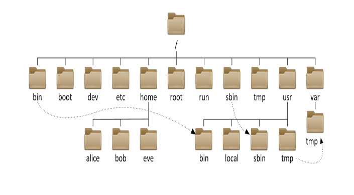

# centos7 基础学习笔记

> CentOS-7-x86_64-Minimal-1908.iso

## 查看IP

1. ifconfig
2. ip addr
3. vi /etc/sysconfig/network-scripts/ifcfg-xxx
4. yun install net-tools

## 设置公网IP

1. 在文件 `/etc/sysconfig/network-scripts/ifcfg-xxx`, xxx：表示网卡的名称(我的是enp0s3), 修改文件中的 `ONBOOT=no` 为 `ONBOOT=yes`。

2. 启动网卡的服务 `service network restart`。

3. 此时使用 `ip addr` 查看到网址时，虚拟机中的内网IP是：10.0.2.15。

4. 安装 net-tools 网络工具。

* 由于安装的 CentOS 系统是精简版 `CentOS-7-x86_64-Minimal-1908.iso`, 在使用 `ifconfig` 命令是找不到的，需要安装 `net-tools`。`yum install net-tools`。

5. 使用命令 `ifconfig` 查看IP，虚拟机中的内网IP是：10.0.2.15。

6. 由于使用的是 VirtualBox 虚拟机工具。设置一些虚拟机中的系统的公网 IP，以便主机访问该虚拟机中的某个系统（centos7）。
在VirtualBox 虚拟机工具 设置-->网络, 连接方式为**桥接网卡**。

7. 进入虚拟机中的 centos7 系统，`ifconfig` 查看IP：192.168.1.16。这样可以通过工具（xshell）指定这个 IP 访问到该虚拟机。

8. 在 xshll 中查看版本：`cat /etc/redhat-release` CentOS Linux release 7.7.1908 (Core)

9. 在 xshell 中，安装 wget：`yum install wget`。

## 替换 centos 中的默认源

> 这样是为了下载一些软件比较快。http://mirrors.163.com/.help/centos.html，按照网址中的说明配置一下。

1. 首先备份/etc/yum.repos.d/CentOS-Base.repo

```bash
mv /etc/yum.repos.d/CentOS-Base.repo /etc/yum.repos.d/CentOS-Base.repo.backup
```

2. 下载对应版本repo文件, 放入到这个 `/etc/yum.repos.d/` 文件夹下。

3. 进入 `cd /etc/yum.repos.d/` 这个文件夹路径里。
我使用的是centos7，因此使用wget：`wget http://mirrors.163.com/.help/CentOS7-Base-163.repo`下载一些如下文件：

```bash
[root@localhost yum.repos.d]# ls
CentOS7-Base-163.repo    CentOS-fasttrack.repo
CentOS-Base.repo.backup  CentOS-Media.repo
CentOS-CR.repo           CentOS-Sources.repo
CentOS-Debuginfo.repo    CentOS-Vault.repo
```

4. 运行以下命令生成缓存

```bash
yum clean all
yum makecache
```

5. 下载安装 vim 测试一下，快了很多，`yum install vim`。

6. 测试 vim 安装成功。`vim --version`

## SSH工具

1. 安装客户端的 SSH 工具， 如：windows：xshell、putty、securecrt 等，Linux：ssh、scp、sftp 等。
2. 安装服务端的 SSH 工具，如：sshd。

Linux 安装 SSH 工具：

```bash
# 首先查看是否有 SSH 服务
rpm -qa | grep ssh
```
如下内容：
```bash
[root@localhost ~]# rpm -qa | grep ssh
openssh-clients-7.4p1-21.el7.x86_64
libssh2-1.8.0-3.el7.x86_64
openssh-7.4p1-21.el7.x86_64
openssh-server-7.4p1-21.el7.x86_64
```

如果没有就继续安装 SSH 工具：

```shell
# 安装 SSH 工具
yum install openssh-server
```

```bash
# 查看是否启动了 SSH 服务
systemctl status sshd.service
```

如果启动了，如下信息：

```bash
[root@localhost ~]# systemctl status sshd.service
● sshd.service - OpenSSH server daemon
   Loaded: loaded (/usr/lib/systemd/system/sshd.service; enabled; vendor preset: enabled)
   Active: active (running) since Thu 2020-03-26 10:38:21 EDT; 3min 32s ago
     Docs: man:sshd(8)
           man:sshd_config(5)
 Main PID: 11134 (sshd)
   CGroup: /system.slice/sshd.service
           └─11134 /usr/sbin/sshd -D
```

```bash
# 启动 SSH 服务
service sshd start
```

提示信息：Redirecting to /bin/systemctl restart sshd.service， 意思是使用，命令 `systemctl restart sshd.service` 重启 SSH 服务。

```bash
#如果没有启动，则需要启动该服务：
systemctl start sshd.service
# 重启 sshd 服务：
systemctl restart sshd.service
# 设置服务开机自启：
systemctl enable sshd.service
```

PS：使用命令 `ps -ef | grep ssh` 也可以查看 SSH 服务是否启动，信息如下：

```bash
[root@localhost ~]# ps -ef | grep ssh
root      1333     1  0 09:53 ?        00:00:00 sshd: root@pts/0
root     11154     1  0 10:42 ?        00:00:00 /usr/sbin/sshd -D
root     11214  1338  0 10:47 pts/0    00:00:00 grep --color=auto ssh
```

## 客户端，使用 SSH 连接
在 xshell 输入命令（ssh 账号@IP地址）：`ssh root@192.168.1.16`, 回车后提示输入密码。

## SSH 的 config 的基本配置

* config 为了批量管理多个SSH
* config 存放在 ~/.ssh/ 这个路径下，没有 config 文件，就进入这个 `~/.ssh/` 路径下，创建 config 文件。`touch config`

在 config 文件中输入内容：

```txt
host "tom"
    HostName 192.168.1.16
    User root
    Port 22

host "tom"                    		#别名
    HostName 192.168.1.16     		#IP
    User root                 		#账户
    Port 22                  		#端口
```

保存该 config 文件后，再次通过 SSH 连接，就可以不使用 IP 连接了。可以 `ssh tom` 回车后，提示输入密码即可。

* 免密登陆

```txt
host "tom"                    		#别名
    HostName 192.168.1.16     		#IP
    User root                 		#账户
    Port 22                  		#端口
	IdentityFile ~/.ssh/id_rsa.pub  #密钥存放路径 [可选]
	IdentitiesOnly yes				#秘钥认证	  [可选]	
```

* ssh key 使用非对称加密方式生成公钥和私钥
* 私钥存放到本地 ~/.ssh/ 目录中
* 公钥对外公开，放在服务器的 ~/.ssh/authorized_keys 文件中

**生成ssh key**

Linux 下生成：

```bash
ssh-keygen -t rsa
ssh-keygen -t dsa
```

windows 下可以使用 工具 xshell 生成，当然还可以使用其他工具。

PS: 注意可能 Linx 的密钥需要：`ssh-add ~/.ssh/tom_rsa`; tom_rsa 这个文件是生成的密钥文件

## CentOS7 基本命令

* 软件的操作命令 `yum`
1. 安装软件：`yum install xxx`
2. 卸载软件：`yum remove xxx`
3. 搜索软件：`yum serach xxx`
4. 清理缓存：`yum clean packages`
5. 列出已安装的软件：`yum list`
6. 软件包的信息：`yum info xxx`

## 查看硬件资源信息

* 内存：`free -m`，-m:表示以兆(M)显示大小

```bash
[root@localhost ~]# free -m
              total        used        free      shared  buff/cache   available
Mem:            991         114         674           6         201         736
Swap:          2047           0        2047
```

1，2表示1，2行的内容：

total1:表示物理，内存总量

used1:总计分配给缓存(包含Buffer和cache)使用的数量，但其中可能部分缓存并未实际使用

free1:未被分配的内存

shared1:共享内存，一般系统不会用到

buffers1:系统分配但未被使用的buffers数量

cached1:系统分配但未被使用的cache数量

used2:实际使用的buffers和cache总量，也是实际使用的内存总量

free2:未被使用的Buffers和cache和未被分配的内存之和，这就是系统当前实际可用内存

* 硬盘：`df -h`，额外了解一下 fdisk 命令。
* 负载：`w` 或 `top`，

```bash
[root@localhost ~]# w
 07:32:01 up 27 min,  2 users,  load average: 0.00, 0.01, 0.02   
USER     TTY      FROM             LOGIN@   IDLE   JCPU   PCPU WHAT
root     tty1                      07:06    8:01   0.19s  0.19s -bash
root     pts/0    192.168.1.4      07:25    1.00s  0.02s  0.01s w
```

load average: 0.00, 0.01, 0.02 这里注意一下，平均负载，依次的含义是：最近1分钟，最近5分钟，最近15分钟，的CPU负载。一般整个阈值在0.6~0.7就表示负载很高了，可以开始报警了。

* CPU 个数和核数

```bash
[root@localhost ~]# cat /proc/cpuinfo 
processor	: 0
vendor_id	: GenuineIntel
cpu family	: 6
model		: 158
model name	: Intel(R) Core(TM) i7-8700 CPU @ 3.20GHz
stepping	: 10
cpu MHz		: 3192.004
cache size	: 12288 KB
physical id	: 0
siblings	: 1
core id		: 0
cpu cores	: 1
apicid		: 0
initial apicid	: 0
fpu		: yes
fpu_exception	: yes
cpuid level	: 22
wp		: yes
flags		: fpu vme de pse tsc msr pae mce cx8 apic sep mtrr pge mca cmov pat pse36 clflush mmx fxsr sse sse2 syscall nx rdtscp lm constant_tsc rep_good nopl xtopology nonstop_tsc eagerfpu pni pclmulqdq monitor ssse3 cx16 sse4_1 sse4_2 x2apic movbe popcnt aes xsave avx rdrand hypervisor lahf_lm abm 3dnowprefetch rdseed clflushopt
bogomips	: 6384.00
clflush size	: 64
cache_alignment	: 64
address sizes	: 39 bits physical, 48 bits virtual
power management:
```

* 文件操作命令 

1. Linux 文件系统结构


有一个破浪号 ~ 表示当前用户的家目录

/ ：根目录，位于 Linux 文件系统目录结构的顶层，一般根目录下只存放目录，不要存放文件，/etc、/bin、/dev、/lib、/sbin 应该和根目录放置在一个分区中。

/bin : 提供用户使用的基本命令， 存放二进制命令，不允许关联到独立分区，OS启动会用到里面的程序。

/boot : 用于存放引导文件,内核文件,引导加载器.

/sbin : 管理类的基本命令，不能关联到独立分区，OS启动时会用到的程序（重要的命令通常处于 bin，不重要的则安装在 sbin ）。

/lib : 存放系统在启动时依赖的基本共享库文件以及内核模块文件. 系统使用的函数库的目录 也存放了大量的脚本库文件 ，程序在执行过程中，需要调用时会用到

/lib64 : 存放64位系统上的辅助共享库文件.

/etc ：系统配置文件存放的目录，该目录存放系统的大部分配置文件和子目录，不建议在此目录下存放可执行文件 。

/home : 普通用户主目录，当新建账户时，都会分配在此，建议单独分区，并分配额外空间用于存储数据。

/root : 系统管理员 root 的宿主目录，系统第一个启动的分区为 / ，所以最好将 /root 和 / 放置在一个分区下。

/media : 便携式移动设备挂载点目录.

/mnt : 临时文件系统挂载点.

/dev ：设备（device）文件目录，存放 Linux 系统下的设备文件，访问该目录下某个文件，相当于访问某个设备，存放连接到计算机上的设备（终端、磁盘驱动器、光驱及网卡等）的对应文件 (b 随机访问，c 线性访问)

/opt : 第三方应用程序的安装位置.

/srv ：服务启动之后需要访问的数据目录，存放系统上运行的服务用到的数据，如: www 服务需要访问的网页数据存放在 /srv/www 内。

/tmp : 存储临时文件， 任何人都可以访问,重要数据一定不要放在此目录下。

/usr ：用户应用程序存放目录，/usr/bin 存放保证系统拥有完整功能而提供的应用程序， /usr/share 存放共享数据，/usr/lib 存放不能直接运行的，却是许多程序运行所必需的一些函数库文件，_/usr/local 存放软件升级包，第三方应用程序的安装位置，/usr/share/doc _系统说明文件存放目录。

/var ：放置系统中经常要发生变化的文件，如日志文件。/var/log 日志目录及文件 ./var/tmp :保存系统两次重启之间产生的临时数据.

/proc : 用于输出内核与进程信息相关的虚拟文件系统，目录中的数据都在内存中，如: 系统核心、外部设备、网络状态，由于数据都存放于内存中，所以不占用磁盘空间

/sys : 用于输出当前系统上硬件设备相关的虚拟文件系统.

/selinux ：存放 selinux 相关的信息安全策略等信息.

2. 文件基本操作

pwd : 显示当前目录所在的的绝对路径

ls ：查看当前目录下的文件

touch ：新建文件

mkdir ：新建文件夹 `mkdir -p a/b` -p: 表示循环创建

cd ：切换并进入目录

rm : 删除文件和目录 `rm -rvf d` -r：表示循环删除，-v：表示显示已删除的，-f: 表示强制删除，不提醒用户是否确定删除。

mv ：移动文件或文件夹

cp ：复制

3. 文件权限 （r-4, w-2, x-1）rwxrwxrwx=777表示可读可写可执行
4. 文件搜索，查找，读取

tail ：从文件尾部开始读

head ：从文件头部开始读

cat ：读取整个文件

more ：分页读取

less ： 可控分页

grep ：搜索关键字

find ：插件文件

wc ：统计个数

5. 文件的压缩和解压

tar 命令使用，注意命令中参数的位置问题。

* 系统用户操作命令

useradd ：添加用户

adduser ：添加用户

userdel ：删除用户

passwd ：设置密码

## 符号链接和硬链接

> 软链接：ln -s 源文件 目标文件 
> 硬链接：ln 源文件 目标文件 
> 源文件：即你要对谁建立链接

* 符号链接（软链接）

> 软链接可以理解成快捷方式, 它和 windows 下的快捷方式的作用是一样的.

```bash
ln -s /usr/software/nodejs/bin/tsc /usr/local/bin/
```

* 硬链接

> 硬链接等价于 `cp -p` 加同步更新. (copy 一份)

```bash
ln /usr/software/nodejs/bin/tsc /usr/local/bin/
```

## 删除软链接

```bash
ln /usr/software/nodejs/bin/tsc /usr/local/bin/
rm -rivf tsc 
```

**注意**：删除的时候，后面千万有一个反斜杠'/'（例如：`tsc/`）, 就会删除到文件夹下的文件, 这样操作很危险，正确操作是不要带有反斜杠 '/' 