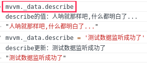

# ES5 Object.defineProperty 实现 MVVM

**思路：**

1. 实现数据监听器 Observer，用 Object.defineProperty() 重写数据的 get、set，值更新就在 set 中通知订阅者更新数据。
2. 实现模板编译 Compile，深度遍历 dom 树，对每个元素节点的指令模板进行替换数据以及订阅数据。
3. 实现 Watch 用于连接 Observer 和 Compile，能够订阅并收到每个属性变动的通知，执行指令绑定的相应回调函数，从而更新视图。
4. Mvvm 入口函数，整合以上三者。

**实例**

```js
const mvvm = new Mvvm({
  el: '#app',
  data: {
    people: '人类这种生物',
    person: {
      hande: '机智的头部',
      foot: '行走的脚',
      breast: '坦荡的胸'
    },
    describe: '人呐就那样吧,什么都明白了...',
    prvAge: 22,
    nowAge: 1
  },
  computed: {
    // 这里的计算属性，没有做到像 vue 那样一般情况下不允许下直接修改计算属性的值，例：这样是不允许的 mvvm.age = 34;
    age() {
      return this.nowAge + this.prvAge;
    }
  },
  mounted() {
    console.log('I am mounted', this.prvAge);
  }
});
```

## 入口 Mvvm 类函数

整合数据劫持、模板编译、数据<=>视图更新的中间站 watch（连接 Observer 和 Compile）

```js
// 整合数据监听器 this._observer()、
// 指令解析器 this._compile()、
// 连接 Observer 和 Compile 的 _watchers 的 watch 池
function Mvvm (options = {}) {
  this.$options = options;
  this.$el = document.querySelector(options.el);
  this._data = options.data;
  this._watchers = {};
  this._observer(this._data); // 重写数据的 get，set
  this._compile(this.$el); // 编译模板，发布订阅
}
```

## 数据劫持（数据监听）

```js
// 实现思路中的第一步：用 Object.defineProperty() 遍历 data 重写所有属性的 get set
// 实现据监听器函数
// 在 set 中我们监听到数据的变化，然后就触发 watch 更新视图
Mvvm.prototype._observer = function (data) {
  const vm = this;
  // 遍历 options.data 数据
  Object.keys(data).forEach(key => {
    // 每个数据的订阅池
    vm._watchers[key] = {
      _directives: []
    };
    let value = data[key]; // 获取 options.data 属性对应的值
    const watchers = vm._watchers[key]; // 数据的订阅池

    // 数据的重写 get, set
    Object.defineProperty(vm._data, key, {
      configurable: true, // 可删除
      enumerable: true, // 可遍历
      get () {
        console.log(`${key}的值：${value}`);
        return value;
      },
      set (newVal) {
        console.log(`${key}更新：${newVal}`);
      }
    });
  });
  console.log('options:', data);
}
```

**测试数据是否监听成功**

使用 Mvvm 的实例 mvvm 访问：




## 实现 Compile 模板编译函数

```js
Mvvm.prototype._compile = function (el) {
  const vm = this;
  const nodes = el.children; // 获取根元素的所有子元素 DOM
  console.log('$el:', nodes);
}
```