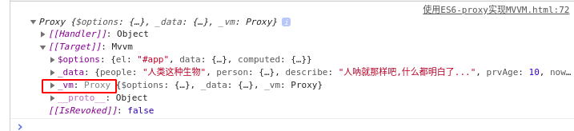
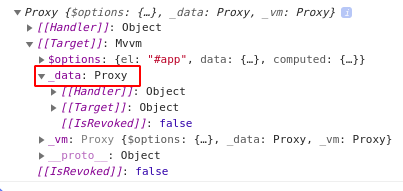

# ES6 Proxy 实现简单的 MVVM

> `Proxy` 是 ES6 新的 API, 它可以对所需要操作的目标对象之前做一层"拦截"处理,外部对该目标对象的访问，都必须先通过
> 这层拦截,这样就可以对外部的访问进行过滤和改写.类似于 ES5 中的 `Object.defineProperty()`.

简单说一下 `new Proxy(param1, param2)`

```javascript
// 目标对象
  let targetObj = {};
  const proxyObj = new Proxy(targetObj, {
    get(target, key, receiver) {
      console.log(`getting ${key}`);
      return Reflect.get(target, key, receiver);
    },
    set(target, key, value, receiver) {
      console.log(`setting ${key}`);
      return Reflect.set(target, key, value, receiver);
    }
  });

  // 访问操作目标对象
  // 赋值
  proxyObj.count = 1; // setting count
  // 获取
  proxyObj.count // getting count
```

PS: `new Proxy(param1, param2)` 中 param1 表示需要拦截的对象, param2 表示用来定制拦截行为的对象.

## MVVM 的简单页面, 类似与 Vue

```html
 <div id="app">
    <h1>人类：{{people}}</h1>
    <h2>组成部分：</h2>
    <ul>
      <li>{{person.hande}}</li>
      <li>{{person.foot}}</li>
      <li>{{person.breast}}</li>
    </ul>
    <h2>描述：</h2>
    <p>{{describe}}</p>
    <!-- <p>年龄：{{age}}</p> -->
    <input placeholder="人呐" v-module="people" />
  </div>
  <script>
  const mvvm = new Mvvm({
    el: '#app',
    data: {
      people: '人类这种生物',
      person: {
        hande: '机智的头部',
        foot: '行走的脚',
        breast: '坦荡的胸'
      },
      describe: '人呐就那样吧,什么都明白了...',
      prvAge: 10,
      nowAge: 1
    },
    computed: {
      age() {
        return this.nowAge + this.prvAge
      }
    }
  })
  </script>
```

实现一个类

```javascript
class Mvvm {
  constructor(options = {}) {
    // 把options 赋值给 this.$options
    this.$options = options;
    // 把 options.data 赋值给 this._data
    let data = this._data = this.$options.data;
    let vm = this.initVm.call(this);
    // 要使得 Proxy 起作用，必须针对 Proxy 实例, 所以返回 Proxy 是实例
    return this._vm;
  }
  initVm() {
    // 使用 Proxy 代理
    this._vm = new Proxy(this, {
      // 拦截get
      get: (target, key, receiver) => {
        return this[key] || this._data[key] || this._computed[key];
      },
      // 拦截set
      set: (target, key, value) => {
        return Reflect.set(this._data, key, value);
      }
    });
    return this._vm;
  }
}

console.log(mvvm);
```



PS: 打印出 mvvm 对象, 发现只有 _vm 通过了代理, 其他的 _data 下的所有数据没有通过代理处理, 因此, 接下来就需要对这些需要代理的目标对象做处理了.

在构造函数中添加一个数据处理的函数. `initObserve.call(this, data)`

```javascript
// 创建观察类
class Observe {
  constructor(data) {
    for (let key in data) {
      // 递归调用子对象, 通过层层递归添加proxy，把 _data 对象都添加一遍代理
      data[key] = observe(data[key]);
    }
    return this.proxy(data);
  }
  proxy(data) {
    return new Proxy(data, {
      get: (target, key, receiver) => {
        return Reflect.get(target, key, receiver);
      },
      set: (target, key, value) => {
        // 对于新添加的对象也要进行添加observe
        const result = Reflect.set(target, key, observe(value)); 
        return result;
      }
    });
  }
}
// 为了下面递归调用
function observe(data) {
  if (!data || typeof data !== 'object') {
    // 如果不是对象直接返回值
    return data;
  }
  return new Observe(data); // 调用类观察对象 Observe
}
class Mvvm {
  constructor(options = {}) {
    // 把options 赋值给 this.$options
    this.$options = options;
    // 把 options.data 赋值给 this._data
    let data = this._data = this.$options.data;
    let vm = this.initVm.call(this);

    // 把 this._data 的数据都添加到代理
    this.initObserve.call(this, data);

    // 要使得 Proxy 起作用，必须针对 Proxy 实例, 所以返回 Proxy 是实例
    return this._vm;
  }

  // 把 this._vm 添加代理
  initVm() {
    // 使用 Proxy 代理
    this._vm = new Proxy(this, {
      // 拦截get
      get: (target, key, receiver) => {
        return this[key] || this._data[key] || this._computed[key];
      },
      // 拦截set
      set: (target, key, value) => {
        return Reflect.set(this._data, key, value);
      }
    });
    return this._vm;
  }

  // 对 this._data 的数据添加代理
  initObserve(data) {
    this._data = observe(data); // 把所有observe都赋值到 this._data
  }
}

const mvvm = new Mvvm({
  el: '#app',
  data: {
    people: '人类这种生物',
    person: {
      hande: '机智的头部',
      foot: '行走的脚',
      breast: '坦荡的胸'
    },
    describe: '人呐就那样吧,什么都明白了...',
    prvAge: 10,
    nowAge: 1
  },
  computed: {
    age() {
      return this.nowAge + this.prvAge;
    }
  }
});

console.log(mvvm)
```



PS: 打印出 mvvm 对象, 对 _data 下的所有数据没有通过代理处理.

## 对 HTML 模板的编译

> 在 MVVM 构造函数中 添加 `new Compile(this.$options.el, vm)` 编译函数

```javascript
// 创建观察类
class Observe {
  constructor(data) {
    for (let key in data) {
      // 递归调用子对象, 通过层层递归添加proxy，把 _data 对象都添加一遍代理
      data[key] = observe(data[key]);
    }
    return this.proxy(data);
  }
  proxy(data) {
    return new Proxy(data, {
      get: (target, key, receiver) => {
        return Reflect.get(target, key, receiver);
      },
      set: (target, key, value) => {
        // 对于新添加的对象也要进行添加observe
        const result = Reflect.set(target, key, observe(value)); 
        return result;
      }
    });
  }
}
// html 模板编译类
class Compile {
  constructor(el, vm) {
    // 受 MVVM 管理的数据缓存
    this.vm = vm;
    // 受 MVVM 管理的 HTML 根节点
    let element = document.querySelector(el);

    // 为了性能,使用碎片添加操作元素
    let fragment = document.createDocumentFragment(); // 创建fragment代码片段
    // 把受 MVVM 管理的根节点添加到创建的 fragment 代码片段中
    fragment.append(element);
    // 模板的编译处理函数
    this.compile(fragment);

    document.body.appendChild(fragment);
  }
  compile(fragment) {
    // 获取缓存的的数据
    let vm = this.vm;
    // 循环操作子元素
    Array.from(fragment.childNodes).forEach((node) => {
        // 获取到文本
      let txt = node.textContent;

      // 匹配大括号 {{}} 中的变量  (这个需要优化, 如果大括号的两端有空格就有问题)
      let reg = /\{\{(.*?)\}\}/g;
      // 说明是文本节点
      if (node.nodeType === 3 && reg.test(txt)) {
        // 如果匹配到的，就替换文本
        node.textContent = txt.replace(reg, (matched, placeholder) => {
          let text = placeholder.split('.').reduce((obj, key) => {
            return obj[key]; // 如：获取到 vm.person.foot 对象的值
          }, vm);
          return text;
        });
      }
      // 如果还有字节点，并且长度不为0 
      if (node.childNodes && node.childNodes.length > 0) {
        // 直接递归匹配替换
        this.compile(node);
      }
    });
  }
}
// 为了下面递归调用
function observe(data) {
  if (!data || typeof data !== 'object') {
    // 如果不是对象直接返回值
    return data;
  }
  return new Observe(data); // 调用类观察对象 Observe
}
class Mvvm {
  constructor(options = {}) {
    // 把options 赋值给 this.$options
    this.$options = options;
    // 把 options.data 赋值给 this._data
    let data = this._data = this.$options.data;
    let vm = this.initVm.call(this);

    // 把 this._data 的数据都添加到代理
    this.initObserve.call(this, data);

    // 添加一个模板编译函数
    new Compile(this.$options.el, vm);

    // 要使得 Proxy 起作用，必须针对 Proxy 实例, 所以返回 Proxy 是实例
    return this._vm;
  }

  // 把 this._vm 添加代理
  initVm() {
    // 使用 Proxy 代理
    this._vm = new Proxy(this, {
      // 拦截get
      get: (target, key, receiver) => {
        return this[key] || this._data[key] || this._computed[key];
      },
      // 拦截set
      set: (target, key, value) => {
        return Reflect.set(this._data, key, value);
      }
    });
    return this._vm;
  }

  // 对 this._data 的数据添加代理
  initObserve(data) {
    this._data = observe(data); // 把所有observe都赋值到 this._data
  }
}

const mvvm = new Mvvm({
  el: '#app',
  data: {
    people: '人类这种生物',
    person: {
      hande: '机智的头部',
      foot: '行走的脚',
      breast: '坦荡的胸'
    },
    describe: '人呐就那样吧,什么都明白了...',
    prvAge: 10,
    nowAge: 1
  },
  computed: {
    age() {
      return this.nowAge + this.prvAge;
    }
  }
});

console.log(mvvm)
```

这样除了 HTML 模板页面的计算属性(computed中的age)的无法编译外都可以把数据值显示到页面了. 虽然现在已经可以把数据编译到页面显示了,但是还没有做到数据变化了页面数据也能相应的变化, 接下来就是实现数据的响应(订阅发布数据).

## 订阅发布

> 核心: 把一组需要操作的函数功能添加到一个数组中, 之后就是循环数据来调用这些相应的数组中的函数.

简单的代码理解一下

```javascript
let arr = [];
let fn = () => { console.log('fn') };

// 订阅的时候, 添加到数组中.
arr.push(fn) // 订阅 fn 函数
arr.push(fn) // 又订阅 fn 函数
arr.push(fn) // 再次订阅 fn 函数
// ... 还可以继续订阅

arr.forEach(fn => fn()) // 发布所有
```

### 实现一个订阅类

```javascript
// 订阅类
class Dep {
  constructor() {
    // 定义数组, 存储订阅者函数
    this.subs = [];
  }
  // 订阅函数
  addSub(sub) {
    this.subs.push(sub);
  }
  // 发布函数(触发函数)
  notify() {
    this.subs.filter(item => typeof item !== 'string').forEach(sub => sub.update());
  }
}
```

PS: 但是在什么时候订阅，什么时候发布？ 在数据获取的时候订阅 watcher，然后在数据设置的时候发布 watcher，在上面的 Observe 类里面做处理.

```javascript
// 创建观察类
class Observe {
  constructor(data) {
    // 创建订阅这对象
    this.dep = new Dep(); // 订阅者类
    for (let key in data) {
      // 递归调用子对象, 通过层层递归添加proxy，把 _data 对象都添加一遍代理
      data[key] = observe(data[key]);
    }
    return this.proxy(data);
  }
  proxy(data) {
    // 获取订阅这对象
    let dep = this.dep;
    return new Proxy(data, {
      get: (target, key, receiver) => {
        if (Dep.target) {
          // 如果之前是push过的，就不用重复push了
          if (!dep.subs.includes(Dep.exp)) {
            // 把 Dep.exp。push到sub数组里面，订阅
            dep.addSub(Dep.exp);
            // 把Dep.target。push到sub数组里面，订阅
            dep.addSub(Dep.target);
          }
        }
        return Reflect.get(target, key, receiver);
      },
      set: (target, key, value) => {
        // 对于新添加的对象也要进行添加 observe
        const result = Reflect.set(target, key, observe(value));
        // 发布
        dep.notify();
        return result;
      }
    });
  }
}
```

## watche 监听类实现

> `Watcher`类就是我们要订阅的 `watcher`, 里面有回调函数 `fn`, 有 `update` 函数调用 `fn`.

```javascript
// 监听数据变化类
class Watcher {
  constructor(vm, exp, fn) {
    this.fn = fn;
    // 传进来的匹配到 exp 例如："people"，"person.foot" 等
    this.exp = exp;
    this.vm = vm;
    // 给 Dep 类挂载一个 exp
    Dep.exp = exp;
    // 给 Dep 类挂载一个 watcher 数据监听对象，更新的时候需要
    Dep.target = this;

    let arr = exp.split('.');
    let val = vm;
    arr.forEach(key => {
      // 获取值，此时就会触发 vm.proxy 的 get() 函数，get() 里面就添加 addSub 订阅函数
      val = val[key];
    })
    // 添加了订阅之后，把 Dep.target 清空
    Dep.target = null;
  }

  update() {
    // 设置值会触发 vm.proxy.set 函数，然后调用发布的 notify，
    // 最后调用 update，update 里面继续调用 this.fn(val).
    let exp = this.exp;
    let arr = exp.split('.');
    let val = this.vm;
    arr.forEach(key => {
      val = val[key];
    })
    this.fn(val);
  }
}
```

PS: 接下来,在哪里使用该 `Watcher` 监听类, 在 Complie 模板编译类里操作.

Watcher 类的调用,监听数据变化.

```javascript
// html 模板编译类
class Compile {
  constructor(el, vm) {
    // 受 MVVM 管理的数据缓存
    this.vm = vm;
    // 受 MVVM 管理的 HTML 根节点
    let element = document.querySelector(el);

    // 为了性能,使用碎片添加操作元素
    let fragment = document.createDocumentFragment(); // 创建fragment代码片段
    // 把受 MVVM 管理的根节点添加到创建的 fragment 代码片段中
    fragment.append(element);
    // 模板的编译处理函数
    this.compile(fragment);
    document.body.appendChild(fragment);
  }
  compile(fragment) {
    // 获取缓存的的数据
    let vm = this.vm;
    // 循环操作子元素
    Array.from(fragment.childNodes).forEach((node) => {
        // 获取到文本
      let txt = node.textContent;

      // 匹配大括号 {{}} 中的变量
      let reg = /\{\{(.*?)\}\}/g;
      // 说明是文本节点
      if (node.nodeType === 3 && reg.test(txt)) {
        replaceTxt();
        // 局部函数
        function replaceTxt() {
          // 如果已经匹配到，就替换文本
          node.textContent = txt.replace(reg, (matched, placeholder) => {
            // 监听变化，进行匹配替换内容
            new Watcher(vm, placeholder, replaceTxt);

            let text = placeholder.split('.').reduce((obj, key) => {
              // 如：获取到 vm.person.foot 对象的值
              return obj[key];
            }, vm);
            return text;
          });
        }
      }
      // 如果还有字节点，并且长度不为0 
      if (node.childNodes && node.childNodes.length > 0) {
        // 直接递归匹配替换
        this.compile(node);
      }
    });
  }
}
```

PS: 这样就可以通过 MVVM 实例修改数据了,同时页面也会有变化.

```javascript
// 页面的显示也变化了.
mvvm.people = "变了一个人...";
```

PS: 响应数据已经可以使用了,那么接下来就是先数据的双向绑定.

## 数据双向绑定

> `<input placeholder="人呐" v-module="people" />`， `v-module` 绑定了一个 `people`，然后在 `Compile` 类里面的 `compile` 函数里操作处理.

```javascript
// html 模板编译类
class Compile {
  constructor(el, vm) {
    // 受 MVVM 管理的数据缓存
    this.vm = vm;
    // 受 MVVM 管理的 HTML 根节点
    let element = document.querySelector(el);

    // 为了性能,使用碎片添加操作元素
    let fragment = document.createDocumentFragment(); // 创建fragment代码片段
    // 把受 MVVM 管理的根节点添加到创建的 fragment 代码片段中
    fragment.append(element);
    // 模板的编译处理函数
    this.compile(fragment);
    document.body.appendChild(fragment);
  }
  compile(fragment) {
    // 获取缓存的的数据
    let vm = this.vm;
    // 循环操作子元素
    Array.from(fragment.childNodes).forEach((node) => {
        // 获取到文本
      let txt = node.textContent;

      // 匹配大括号 {{}} 中的变量
      let reg = /\{\{(.*?)\}\}/g;

      // 对节点判断是否是元素属性节点
      if (node.nodeType === 1) {
          // 获取元素的属性集合
        const nodeAttr = node.attributes;

        Array.from(nodeAttr).forEach(item => {
            let name = item.name; // 属性名
            let exp = item.value; // 属性值
            // 如果属性有 v-
            if (name.includes('v-')){
              node.value = vm[exp];
              node.addEventListener('input', e => {
                // 相当于给 this.people 赋了一个新值
                // 而值的改变会调用 set，set 中又会调用 notify，notify 中调用 watcher 的update 方法实现了更新操作
                vm[exp] = e.target.value;
              })
            }
        });
      }
      // 说明是文本节点
      if (node.nodeType === 3 && reg.test(txt)) {
        replaceTxt();
        // 局部函数
        function replaceTxt() {
          // 如果已经匹配到，就替换文本
          node.textContent = txt.replace(reg, (matched, placeholder) => {
            // 监听变化，进行匹配替换内容
            new Watcher(vm, placeholder, replaceTxt);

            let text = placeholder.split('.').reduce((obj, key) => {
              // 如：获取到 vm.person.foot 对象的值
              return obj[key];
            }, vm);
            return text;
          });
        }
      }
      // 如果还有字节点，并且长度不为0 
      if (node.childNodes && node.childNodes.length > 0) {
        // 直接递归匹配替换
        this.compile(node);
      }
    });
  }
}
```

PS: 在页面的 `input` 修改,即可看到效果.

## 计算属性的监听

