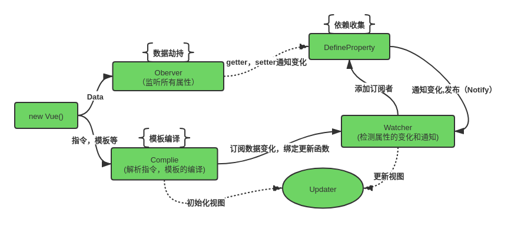

# Vuejs 学习

## :+1: Vue 的数据双向绑定原理

核心使用 ES5 的 API `Object.defineProperty()` 对数据的劫持，劫持数据处理后再再返回给使用者。Vue3.x 话说 通过 ES6 的 API `Proxy()` 来处理。



PS:
1、实现一个 Observer 的监听器，用来劫持并监听所有的属性，如果有操作，则通知订阅者。
2、实现一个 Watcher 的订阅者，用来接收属性的变化通知并执行相应的函数，从而更新视图。
3、实现一个 Compile 的解析器，用来对页面的节点进行扫描并解析每个节点的相关指令，并初始化的模板数据和初始化相应的订阅器

- **创建一个监听器**
  > 实现一个 Observer 的监听器，如果需要对所有属性都进行监听的话，那么可以通过递归方法遍历所有属性值，并对其进行 Object.defineProperty()处理

```javascript
// 1,实现一个 Observer 的监听器，
// 如果需要对所有属性都进行监听的话，那么可以通过递归方法遍历所有属性值，并对其进行Object.defineProperty()处理
function defineReactive(data, key, value) {
  // 遍历递归所有的子属性
  observer(value);
  // 劫持数据
  Object.defineProperty(data, key, {
    enumerable: true,
    configurable: true,
    get() {
      return value;
    },
    set(newValue) {
      value = newValue;
      console.log(
        "属性" + key + "已经被监听，现在值为：“" + newVal.toString() + "”"
      );
    }
  });
}

// 遍历属性
function observer(data) {
  if (!data || typeof data !== "object") {
    return;
  }
  Object.keys(data).forEach(key => {
    defineReactive(data, key, data[key]);
  });
}

// 测试
observer(Demo);
Demo.name = "Jerry";
```

- **接下来，需要一个订阅者容器**

> 订阅者容器（Dep），主要负责收集订阅者,然后在属性变化的时候去执行对应订阅者的更新函数.

```javascript
// 创建一个可以容纳订阅者的消息订阅器 Dep，主要负责收集订阅者，然后在属性变化的时候去执行对应订阅者的更新函数
// 因此修改一下上面的 Observer 监听器
function defineReactive(data, key, value) {
  // 遍历递归所有的子属性
  observer(value);
  // 创建一个消息订阅的容器 Dep,存放所有的订阅者
  const dep = new Dep();
  // 劫持数据
  Object.defineProperty(data, key, {
    enumerable: true,
    configurable: true,
    get() {
      // 判断是否需要添加订阅者
      if (isAddWatcher) {
        // 需要添加订阅者 watcher
        dep.addSub(watcher);
      }
      return value;
    },
    set(newValue) {
      // 判断是否修改了原始的值
      if (val === newVal) {
        return;
      }
      console.log(
        "属性" + key + "已经被监听，以前的值为：“" + value.toString() + "”"
      );
      // 修改旧的值
      value = newValue;
      console.log(
        "属性" + key + "已经被监听，现在值为：“" + newValue.toString() + "”"
      );

      // 如果数据变化，通知所有订阅者 watcher
      dep.notify();
    }
  });
}

// 遍历属性
function observer(data) {
  if (!data || typeof data !== "object") {
    return;
  }
  Object.keys(data).forEach(key => {
    defineReactive(data, key, data[key]);
  });
}

// 订阅者容器
function Dep() {
  this.subs = [];
}
Dep.prototype.addSub = function(sub) {
  // 添加订阅者
  this.subs.push(sub);
};
Dep.prototype.notify = function() {
  // 通知对应订阅者的更新函数，（触发函数）
  this.subs.forEach(sub => {
    // 执行函数
    sub.update();
  });
};
```

- **接下来，需要创建一个订阅者**

> 创建一个订阅者 `Watcher`
> 初始化的时候需要将订阅者（Watcher）自己添加进订阅器 Dep 中，只需要在在初始化订阅者 Watcher 的时候出发 get 就可以了，即获取对应的属性值就即可触发，这非差容易理解。
> 此时，只需要在订阅者初始化（Watcher）初始化的时候才需要添加订阅这，因此，这一判断一下是否在初始化的时候判断是否添加订阅这。那么需要在订阅者容器 Dep 中缓存（Dep.target）一下订阅者，添加成功后，将其删除即可，

```javascript
// 创建一个订阅者
function Watcher(vm, exp, cb) {
  this.vm = vm;
  this.cb = cb;
  this.exp = exp;
  // 将自己添加到订阅其的操作
  this.value = this.get();
}
Watcher.prototype.update = function() {
  this.run();
};
Watcher.prototype.run = function() {
  var value = this.vm.data[this.exp];
  var oldVal = this.value;
  if (value !== oldVal) {
    this.value = value;
    this.cb.call(this.vm, value, oldVal);
  }
};
Watcher.prototype.get = function() {
  // 缓存自己
  Dep.target = this;
  // 强制执行监听器里的get函数
  var value = this.vm.data[this.exp];
  // 释放自己
  Dep.target = null;
  return value;
};
```

与此同时，需要对监听器 Observer 修改一下，主要是对应 Watcher 类原型上的 get 函数。需要调整地方在于 defineReactive 函数

```javascript
function defineReactive(data, key, value) {
  // 遍历递归所有的子属性
  observer(value);
  // 创建一个消息订阅的容器 Dep,存放所有的订阅者
  const dep = new Dep();
  // 劫持数据
  Object.defineProperty(data, key, {
    enumerable: true,
    configurable: true,
    get() {
      // 判断是否需要添加订阅者
      if (Dep.target) {
        // 需要添加订阅者 watcher
        dep.addSub(Dep.target);
      }
      return value;
    },
    set(newValue) {
      // 判断是否修改了原始的值
      if (val === newVal) {
        return;
      }
      console.log(
        "属性" + key + "已经被监听，以前的值为：“" + value.toString() + "”"
      );
      // 修改旧的值
      value = newValue;
      console.log(
        "属性" + key + "已经被监听，现在值为：“" + newValue.toString() + "”"
      );

      // 如果数据变化，通知所有订阅者 watcher
      dep.notify();
    }
  });
  Dep.target = null;
}
```

## :+1: Vue2.x 生命周期


## :+1: Vue 组件

> `Vue.extend(options);` options 是对象；使用基础 Vue 构造器，创建一个子类，参数是一个包含组件选项的对象，data 选项是特例，它必须是函数。

```javascript
let BaseExtendComponent = Vue.extend({
  name: "BaseExtendComponent",
  template: "<h2>== {{name}} ==</h2>",
  data() {
    return {
      name: "Timly"
    };
  }
});

// 用法一，创建一个 BaseExtendComponent 实例，挂载到元素上
new BaseExtendComponent().$mount("#lyTest");

// 用法二，将组件注册到  Vue.component(); 全局方法里面
Vue.component(BaseExtendComponent.name, BaseExtendComponent);
// 页面使用
<div class="component">
  <BaseExtendComponent />
</div>;

// 用法三，将组件注册为局部组件
new Vue({
  el: "#app",
  data() {
    return {};
  },
  components: {
    BaseExtendComponent
  }
});
// 页面使用
<div class="component">
  <BaseExtendComponent />
</div>;
```

**Vue.extends**

```javascript
let extendsObj = {
  updated() {
    console.log("我是扩展的updated");
  },
  methods: {
    //这个并没有被执行，如果方法名一样，只执行构造器里面的原生方法，混入跟扩展类似
    add() {
      console.log("我是扩展出来的方法");
      this.num++;
    }
  }
};

new Vue({
  el: "#app",
  data() {
    return {
      num: 1
    };
  },
  methods: {
    add() {
      console.log("我是原生的方法");
      this.num++;
    }
  },
  //全局的最优先，混入的先执行，原生的后执行，下面的后执行
  updated() {
    console.log("我是原生的update");
  },
  //下面扩展放的是对象，而混入放的是数组
  extends: extendsObj,
  delimiters: ["${", "}"]
});
```

## Vue 中子组件调用父组件的方法

**方法一：**
通过 `this.$parent` 实现，如：`this.$parent.eventName()`

```javascript
// 父组件
<template>
  <div class="parentCom">
    <child></child>
  </div>
</template>

<script>
import child from "./child.vue";
export default {
  name: "ParentCom",
  components: {
    child
  },
  methods: {
    parentMethods() {
      console.log("test");
    }
  }
}
</script>

/****************************************************/

// 子组件
<template>
  <div class="childCom">
    <button @click="childMethods"></button>
  </div>
</template>

<script>
import child from "./child.vue";
export default {
  name: "ChildCom",
  methods: {
    childMethods()
      // 子组件调用父组件的方法
      this.$parent.parentMethods();
    }
  }
}
</script>
```

**方法二：**
通过 `this.$emit`, 如：`this.$emit("eventName", paramers)`

```javascript
// 父组件
<template>
  <div class="parentCom">
    <child :fatherMethods="parentMethods"></child>
  </div>
</template>

<script>
import child from "./child.vue";
export default {
  name: "ParentCom",
  components: {
    child
  },
  methods: {
    parentMethods() {
      console.log("test");
    }
  }
}
</script>

/****************************************************/

// 子组件
<template>
  <div class="childCom">
    <button @click="childMethods"></button>
  </div>
</template>

<script>
import child from "./child.vue";
export default {
  name: "ChildCom",
  methods: {
    childMethods()
      // 子组件触发父组件的方法
      this.$emit("childMethods", "参数");
    }
  }
}
</script>
```

## Vue 中的一些事件处理

v-on: 缩写 @

```javascript
// 绑定多个事件
<button @click="doSomething" @mousedown="doMousedown" @mouseup="doMouseup">绑定多个事件</button>

// 2.4.0+，对象方式绑定多个事件
<button v-on:={click: doSomthing1, mousedown: doMousedown, mouseup: doMouseup}>对象方式绑定多个事件</button>

// 阻止冒泡
<button @click.stop="doSomething">阻止冒泡</butto>

// 阻止默认行为
<button @click.prevent="doSomething">阻止默认行为</butto>

// 阻止冒泡和默认行为
<button @click.stop.prevent="doSomething">阻止冒泡和默认行为</butto>

// 点击只触发一次
<button v-on：click.once="doSomething">点击只触发一次</butto>
```
