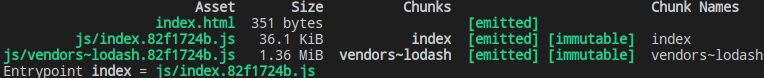
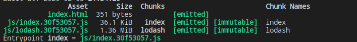
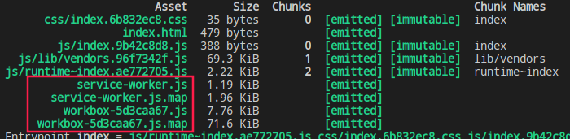

# webpack4

1, webpack助力前端开发的一个模块打包工具.

2, `npx`的会在运行时,到`node_modules/.bin`路径和环境变量`$PATH`里面,检查命令是否存在.

[参考1](https://www.jianshu.com/p/b63cc830aaf3)
[参考2](https://www.jianshu.com/p/75161cbc067e)

## 什么是模块打包工具

- webpack支持的模块方法：ES6、CommonJS、AMD、标签模块(Labeled Modules)、 webpack 特定方法.
- 模块规范：ES Module、CommonJS(Node.js使用该规范)、CMD(requireJS使用该规范)、AMD(SeaJS使用该规范).
- webpack 通过 loader 可以支持各种语言和预处理器编写模块.

## 安装

建议局部安装,这样每个项目如果webpack的版本不一样也不会有意外的错误出现.

1, 安装Node.js(webpack需要nodejs的支持).

- `npm init -y` 初始化一个项目.
- `npm install webpack webpack-cli -D`(项目内安装webpack).
  
如果需要使用指定版本这样操作`npm install webpack@4.16.5 webpack-cli --save-dev` 安装指定版本webpack.

2, `npx webpack -v` 检查当前项目webpack版本.

3, `npm info webpack` 查看webpack历史版本信息.

4, package.json配置信息：
`private: true || false`(防止意外发布私有库,如果你设置`"private": true`,npm就不会发布它.)
main属性值指向模块的入口程序.（一般模块默认为该文件下当前目录下的index.js文件）

## 项目中使用webpack

1, `npx webpack` 默认使用webpack.config.js文件进行打包,使用`npx webpack --config xxx.js`可以指定配置文件进行打包.

2, webpack打包的三种方式

- webpack 入口文件(index.js), 需要全局安装webpack
- npx webpack 入口文件(index.js), 局部安装webpack
- npm run build, 在package.json文件script中配置并指定webpack的处理文件

```js
const path = require('path');
module.exports = {
  // development|none 配置在开发环境(不压缩代码), production 配置在生产环境(会压缩代码)
  mode: 'development',
  entry: { // 入口文件程序. 属性的前后注定打包后通过script的引入的前后,如下 a.js在index.js之前先加载
    a: './src/a.js', 
    index: './src/index.js',
  }，
  output: { // 编译打包后的输出文件信息
    filename: 'bundle.js',
    path: path.resolve(__dirname, 'bundle') // 必须绝对路径
  }
}
```

```json
Hash: 09f836d6278f5500e6e3 (本次打包的hash)
Version: webpack 4.41.5  (本次打包的webpack版本)
Time: 166ms (本次打包的耗时)
Built at: 02/02/2020 3:28:51 PM
  Asset       Size  Chunks             Chunk Names
main.js  963 bytes       0  [emitted]  main
Entrypoint main = main.js (本次打包的后引用入口文件)
[0] ./src/index.js 34 bytes {0} [built]
```

Asset: main.js(打包出来的文件名)

Size: 963 bytes(打包出来的文件大小)

Chunks: 0(每一个js文件对应的ID)  [emitted]

Chunk Names: main(每一个js文件对应的名)

## 什么是loader

webpack默认识别.js结尾的文件,如果不是.js结尾的文件是不能识别的,只能通过配置相应的loader来让webpack可以识别并处理.

## loader 处理图片

url-loader 封装了 file-loader(file-loader处理为的是url路径)，但在文件大小（单位 byte）低于limit指定的限制时，会将图片转化为base64格式. url-loader 如果处理大于limit指定的限制时依赖file-loader, 字体图标打包用 file-loader

```bash
npm install --save-dev file-loader url-loader
```

```js
module: {
  rules: [
    {
      test: /\.jpe?g/,
      use: [
        {
          loader: 'url-loader',
          options: {
            name: '[name].[hash:8].[ext]',
            outputPath: 'assest/', //打包后文件文件输出目录
            limit: 102400, //小于102400kb时,打包为base64格式到js文件中;大于时打包为文件,引用的地方使用路径
          }
        }
      ]
    }
  ]
}
```

## loader 处理CSS样式

1, 使用多个loader时, webpack遵循从右到左, 从下到上的顺序打包.

2, 样式加浏览器前缀可以使用postcss-loader中的autoprefixer插件.

css-loader 处理各个css文件中的css文件依赖,style-loader 负责把css样式插入到页面的style标签中

```bash
npm install --save-dev style-loader css-loader
```

## loader 处理 Less, Stylus, Sass样式的预处理

```bash
npm install less less-loader --save-dev
```

## loader 处理CSS 样式添加前缀

```bash
npm i postcss-loader autoprefixer
```

- 方案一的配置

```js
{
  test: /\.(css|styl|scss|less)/,
  use: [
    'style-loader',
    'css-loader',
    'less-loader',
    {
      loader: 'postcss-loader',
      options: {
        plugins: () => ([
          require('autoprefixer'), // 添加css前缀
        ]),
      },
    }
  ]
},
```

- 方案二的配置, 需要在项目根目录下创建postcss.config.js文件

**postcss.config.js 配置内容**:

```js
module.exports = {
  plugins: [
    require('autoprefixer')
  ]
}
```

**webpack 配置内容**:

```js
{
  test: /\.(css|styl|scss|less)/,
  use: [
    'style-loader',
    'css-loader',
    'less-loader',
    'postcss-loader'
  ]
},
```

## css-loader的局部引入(modules: true)和多个样式文件中@import的文件处理(importLoaders: 2)

```js
{
  test: /\.(css|styl|scss|less)/,
  use: [
    'style-loader',
    {
      loader: 'css-loader',
      options: {
        importLoaders: 2, //配置css-loader 作用于样式文件中 @import 的样式资源都会重新通过postcss-loader.less-loader往上再依次处理 @import 引入的样式文件
        //modules: true这样配置以后,通过 import './index.less'; 方式全局部引入是没有作用的
        modules: true, // css模块 应用import css from './index.less'这样局部引入; css.属性
      },
    },
    'less-loader',
    'postcss-loader' // 这个配合autoprefixer插件添加css前缀,在根目录下创建postcss.config.js
  ]
}
```

PS: 配置`modules: true,`这个时候注意样式的作用情况

**例如**:

```js
import src from './1.jpeg';
import css from './index.less'; // 这样是局部引入
import './index.less'; // 这样是全局部引入是没有作用的
const img = new Image();
img.src = src;
img.classList.add(css.imgStyle); // 这个有样式作用
document.querySelector('#root').append(img);

const imgs = new Image();
imgs.src = src;
imgs.classList.add('imgStyle'); // 这个是没有样式作用的
document.querySelector('#root').append(imgs);
```

## loader 处理字体文件

```js
{
  test: /\.(eot|svg|ttf|woff)$/,
  use: [
    {
      loader: 'file-loader',
      options: {
        outputPath: 'assest/', //打包后文件文件输出目录
      }
    }
  ]
}
```


## plugins 自动模板处（html-webpack-plugin）

```bash
npm install --save-dev html-webpack-plugin
```

```js
plugins: [
    new webpack.ProgressPlugin(), // 进度条
    new CleanWebpackPlugin({
      verbose: true, // 控制台打印日志
    }), // 清除之前打包的所有文件
    new HtmlWebpackPlugin({
      template: './src/index.html',
      chunks: ['index'] // 打包后的文件中引入的入口的js文件，就是entry对象的属性名
    })
  ]
```

## sourceMap 处理

- source-map： 会生成map文件 
- inline：不会生成map文件，但是会在文件后面添加一个base64的字符串
- cheap: 表示代码出错，代码表示那一行出错。如果没有cheap会精确到那一行那一列出错（非常耗费打包性能）
- module： 表示代码不仅仅是自己的业务代码还包含了第三方库（loader）是否出错
- eval: 打包速度最快的一种方式，eval方式处理代码（针对于复杂的代码不建议使用）

PS：需要组合使用

```js
devtool: 'cheap-module-eval-source-map'
```

PS：`cheap-module-eval-source-map`建议使用在开发环境，`cheap-module-source-map`建议使用在生产环境（一般不使用）

## webpack-dev-server

```bash
npm install --save-dev webpack-dev-server
```

```json
"dev": "webpack-dev-server --config config/webpack.prod.config.js"
```

```js
devServer: {
  // webpackDevserver启动的服务在那个文件夹目录下
  contentBase: [path.resolve(__dirname, '../dist')],
  open: true, // 启动项目时会自动打开页面
}
```

## 热更替

表示页面不重新刷新，只是某个文件发生变化做变化处理

```js
devServer: {
  // 热更替
  hot: true, // 开启热更替
  hotOnly: true, // 开启热更替以后需要设置浏览器不刷新页面
  // Other Code ...
},
plugins: [
  // 热加载时直接返回更新文件名,而不是文件的id
  new webpack.NamedModulesPlugin(),
  // 热更新模块
  new webpack.HotModuleReplacementPlugin(),

  // Other Code ...
]
```

## ES5 语法编译

```bash
npm install --save-dev babel-loader @babel/core
```

- webpack 配置

```js
{
  test: /\.js$/,
  exclude: /node_modules/,
  loader: 'babel-loader'
}
```

PS: 虽然 webpack 已经配置好了 Babel ，但并没有让它真正生效。在项目的根目录中创建一个 .babelrc 文件并启用一些插件来编译ES6语法。例如：可以使用  @babel/preset-env 把 ES6 -> ES5 的语法规则。

- 在根目录下创建.babelrc 配置文件

```bash
npm install @babel/preset-env --save-dev
```

```json
{
  "presets": ["@babel/preset-env"]
}
```

也可以这么配置，不使用 .babelrc 文件，直接在webpack文件中配置

```js
{
  test: /\.js$/,
  exclude: /node_modules/,
  loader: 'babel-loader',
  options: {
    'presets': ['@babel/preset-env']
  }
}
```

PS：如果需要使更低版本的浏览器也兼容，补充一些函数等 需要使用`@babel/polyfill` 
安装：`npm install --save @babel/polyfill`; 注意这是用于生产环境的。
**放到业务代码的顶部** `import '@babel/polyfill'` 或者 `require(’@babel/polyfill‘);`;

如果不需要把所有的`@babel/polyfill`都引入，只是需要按需引入，那么在 .babelrc （或者在webpack）中配置 `useBuiltIns: true`。

.babelrc中配置

```json
{
  "presets": [
    ["@babel/preset-env", {"useBuiltIns": "usage"}]
  ]
}
```

webpack中配置

```js
{
  test: /\.js$/,
  exclude: /node_modules/,
  loader: 'babel-loader',
  options: {
    'presets': [
      ['@babel/preset-env', {'useBuiltIns': 'usage'}]
    ]
  }
}
```

如果要指定那些浏览器版本以上的是否有必要编译成低版本的兼容代码（高版本的浏览器对ES6的兼容已经很好了，就不需要再编译了）

```json
{
  "presets": [
    [
      "@babel/preset-env",
      {
        "targets": {"chrome": "67"},
        "useBuiltIns": "usage"
      }
    ]
  ]
}
```

PS: 另外在新版中，还需要`npm install --save core-js@3`

```json
{
  "presets": [
    [
      "@babel/preset-env",
      {
        "targets": {"chrome": "67"},
        "useBuiltIns": "usage",
        "corejs": 3
      }
    ]
  ]
}
```

PS: `useBuiltIns` 的值解析

1, false：不处理 polyfill

2, 'usage'：按需加载 polyfill，且不需要手动引入@babel/polyfill 文件

3, 'entry'：必须手动引入 @babel/polyfill 文件，会把 @babel/polyfill 切为小包，全量引入，但要注意的是，这里的全量并不是真的全量，因为我们没有配置目标浏览器，Babbel 默认转了全量的 ECMAScript 2015+，如果配置了如： targets: "chrome>60" ，会在配置四的编译结果中，包减少到 20+ ，也就是 'entry' 会加载目标浏览器所需的 polyfill


**注意：开发组件库时**:
使用`@babel/plugin-transform-runtime`，不存在全局变量的污染（开发组件库时推荐使用），`@babel/polyfill`会污染全局变量（开发组件库时不推荐使用，在业务代码中还是可以的）
  
PS: 如果是开发自己的组件库是不建议使用 @babel/polyfill , 它处理全局变量会影响到代码。需要使用：

```bash
npm install --save-dev @babel/plugin-transform-runtime
npm install --save @babel/runtime
```

这个 `"corejs": 3`, 配置需要安装：`npm install --save @babel/runtime-corejs3`

```json
{
  // 这个就删除不需要了
  // "presets": [
  //   [
  //     "@babel/preset-env",
  //     {
  //       "targets": {"chrome": "67"},
  //       "corejs": 3,
  //       "useBuiltIns": "usage"
  //     }
  //   ]
  // ],
  "plugins": [
    [
      "@babel/plugin-transform-runtime",
      {
      "corejs": 3,
      "helpers": true,
      "regenerator": true,
      "useESModules": false
      }
    ]
  ]
}
```

## Tree Shaking

在打包后没有引用到模块代码不会打包出去（会删除掉）

注意：只支持ES Module的（静态模块的）模块引入（require是不支持的）

```js
optimization: {
  // 但是一些不需要TreeShaking的模块文件，需要在 package.json 中配置 
  // "sideEffects": ["@babel/polyfill", "*.css"]
  // 表示配置了 TreeShaking 了也不会对这里配置的文件做TreeShaking(比如：@babel/polyfill 和 .css 的文件是不需要TreeShaking，如果都需要TreeShaking操作就配置："sideEffects": false)
  /*
  没有使用TreeShaking前
  ! exports provided: add, minus 

  打包后出现这个表示TreeShaking作用了
  ! exports provided: add, minus 
  ! exports used: add 
  */
  // 如果配置 mode: 'production',是生产环境都不用配置了，已经内置了，但是这个"sideEffects": ["@babel/polyfill", "*.css"]还是需要配置的
  usedExports: true  // 表示导入的模块需要TreeShaking
}
```

## mode的 development 和 production 模式

webpack4 通过 mode 区分是开发环境和生产环境

## code splitting （代码分割）

一般分离第三方库，第三方库一般都不做改动，做分离和缓存

```js
plugins: [
  new webpack.ProgressPlugin(), // 进度条
  new CleanWebpackPlugin({ // 清除之前打包的所有文件
    verbose: true, // 控制台打印日志
  }),
  /**
   * code-spliting webpack3 如下配置,webpack4已经废弃
   * 方案一，分割代码配置
   * 
   * 1, 在入口entry中配置需要分割的第三方库
   * vendor: ['vue', 'axios']
   * 
   * 2, 在入口plugins中配置需要分割的第三方库的chunk名与entry中的属性相同
   * new webpack.optimize.CommonsChunkPlugin({
        name: 'vendor',
      }),
    * 详解：
    * 如下配置分割后的chunk名表示
    * Webpack 大佬，在所有的 chunk 中，帮我找到依赖2次及以上的模块，然后移到 vendor 这个 chunk 里面，感激不尽。
    1, 所有的 chunk（ app.js 和 vendor.js ）中，app.js 和 vendor.js 都引用了 vue 和 axios
    2, 加起来2次，那把他们都移动到 vendor.js 里面。
    3, 最后，app.js 原本包含的 vue 和 axios 都移动到了 vendor.js 。

    方案二，自动分割代码配置，如果我们想把所有 node_modules 目录下的所有 .js 都自动分离到 vendor.js ，则需要用到 minChunks
    1, 不需要在entry配置指定那些第三方库
    entry: {
      // vendor: ['vue', 'axios'] // 删掉!
    },
    2, 直接在 plugins中配置
    new webpack.optimize.CommonsChunkPlugin({
      name: 'vendor',
      minChunks: ({ resource }) => (
        resource &&
        resource.indexOf('node_modules') >= 0 &&
        resource.match(/\.js$/)
      ),
    })
    详解：
    Webpack 大佬，如果你看见某些模块是来自 node_modules 目录的，并且名字是 .js 结尾的话，麻烦把他们都移到 vendor chunk 里去，如果 vendor chunk 不存在的话，就创建一个新的。
      1, 找到了，vue 和 axios 都来自 node_modules 并且是 JS 文件
      2, vendor chunk 不存在，那我就创建一个
      3, 把他们俩移动到 vendor chunk
    */
  new HtmlWebpackPlugin({
    template: './index.html',
    // 如果采用了代码分割注意配置chunks: ['index']会引入不到分割的第三方模块
    // chunks: ['index'] // 打包后的文件中引入的入口的js文件，就是entry对象的属性名
  }),
],
// webpack 4 使用这个 optimization.splitChunks 实现 code-splitting
optimization: {
  splitChunks: { // 表示对webpack对代码分割
    chunks: 'all'
  }
}
```

PS：这样打包的打包出来的一部加载的文件名是ID,不是我们想要的，我们需要的是对应的第三方模块名一致 需要在引入的地方使用 `/* webpackChunkName: "lodash" */`

```js
// 这是异步的加载方式
// 测试 code-ssplitting的异步分割
function getComponent () {
  return import(/* webpackChunkName: "lodash" */'lodash').then(({default: _}) => {
    const element = document.createElement('mark');
    element.innerHTML = _.join(['Tom', 'Jerry'], '@');
    return element;
  });
}

// 也可以这么写
async function getComponent () {
  const {default: _} = await import(/* webpackChunkName: "lodash" */'lodash');
  const element = document.createElement('mark');
  element.innerHTML = _.join(['Tom', 'Jerry'], '@');
  return element;
}
```

PS：此时打包出来的文件名会有一个前缀 **vendors~** 如下图：


PS：如果这里的静态的异步引入报错，需要安装`npm install --save-dev @babel/plugin-syntax-dynamic-import`，在 .babelrc 文件中配置 plugins

```json
{
  "plugins": ["@babel/plugin-syntax-dynamic-import"]
}
```


**splitChunks 中的部分配置详解**

```js
// webpack 4 使用这个 optimization.splitChunks 实现 code-splitting
optimization: {
  splitChunks: { // 表示对webpack对代码分割
    chunks: 'all',
    cacheGroups: {
      vendors: false,
      default: false
    }
  }
}
```

配置了 cacheGroups 打包后的文件没有了 **vendors~** 如下图：



```js
optimization: {
  splitChunks: { // 表示对webpack对代码分割
    // async 只针对于异步引入的做代码分割，如 import(/* webpackChunkName: "lodash" */'lodash').then(({default: _}) => {});有效，对于同步引入的是不会做代码分割的， 如：import _ from 'lodash';
    //all 表示不管是异步还是同步引入都分割，但是需要在cacheGroups中配置
    // initial 表示只对同步的引入做分割
    // 对于同步引入的模块会到cacheGroups中判断一下
    chunks: 'all',
    minSize: 30000, // 针对于引入的模块或者库的文件内容大小，大于30kb就做代码分割，如果小于30kb会走配置cacheGroups中的default的配置（此时default不能配置为false）做代码分割成一个模块
    maxSize: 0,  // 如果打包的模块大于这里配置的数值，会再次做代码分割，（不过一般设置0（或者就不配置了）,没必要再次分割了）
    minChunks: 1, // 表示某个模块引入次数大于等于这里的设置的数值就做代码分割
    maxAsyncRequests: 5, // 表示同时加载的模块数量，如果同时加载的模块数大于这里设置的数值就不会做代码分割了
    maxInitialRequests: 3, // 表示入口文件加载的模块数，大于这里设置的就不会在做代码分割了
    automaticNameDelimiter: '~', // 如果不配置cacheGroups中的filename，默认使用 ～ 作文件名的连接符号， 
    name: true, // 表示打包生成的文件名使用cacheGrops中配置的文件名
    cacheGroups: {
      vendors: { // vendors 任意名
        test: /[\\/]node_modules[\\/]/, // 表示针对于 node_module 中需要引入的第三方模块
        priority: -10, // 表示模块同时满足多个test条件的话，打包的文件优先级会打包到那里去
        filename: 'lib/vendors.min.js' // 打包出的文件名，默认是vendors～模块.js, vendors是和对应的属性一致
      },
      default: {
        minChunks: 2, // 表示某个模块引入次数大于等于这里的设置的数值就做代码分割
        priority: -20,
        reuseExistingChunk: true, //表示如果一个模块已经打包了，再次打包的时候就忽略不重复再次打包，直接使用之前打包的模块
        filename: 'common/common.min.js'
      }
    }
  }
}
```

## 懒加载

```js
function getComponent () {
  // 魔法写法import(/* webpackChunkName: "lodash" */'lodash')
  return import(/* webpackChunkName: "lodash" */'lodash').then(({default: _}) => {
    const element = document.createElement('mark');
    element.innerHTML = _.join(['Tom', 'Jerry'], '@');
    return element;
  });
}

// 也可以这么写
async function getComponent () {
  const {default: _} = await import(/* webpackChunkName: "lodash" */'lodash');
  const element = document.createElement('mark');
  element.innerHTML = _.join(['Tom', 'Jerry'], '@');
  return element;
}
```

## 魔法写法 webpackPrefetch: true

prefetch(预取)：将来某些导航下可能需要的资源

preload(预加载)：当前导航下可能需要资源

```js
// webpackPrefetch 表示等核心代码加载完成才加载(预先加载)
import(/* webpackPrefetch: true */ 'lodash');
```

## CSS样式的分离

```shell
npm install --save-dev mini-css-extract-plugin optimize-css-assets-webpack-plugin
```

```js
const MiniCssExtractPlugin = require('mini-css-extract-plugin');
const OptimizeCSSAssetsPlugin = require("optimize-css-assets-webpack-plugin");
module: {
  rules: [
    {
      test: /\.(s?css|styl|less)/,
      use: [
        MiniCssExtractPlugin.loader,
        {
          loader: 'css-loader',
          options: {
            importLoaders: 2, //配置css-loader 作用于样式文件中 @import 的样式资源都会重新通过postcss-loader.less-loader往上再依次处理 @import 引入的样式文件
            //modules: true这样配置以后,通过 import './index.less'; 方式全局部引入是没有作用的
            // modules: true, // css模块 应用import css from './index.less'这样局部引入; css.属性
          },
        },
        'less-loader',
        'postcss-loader' // 这个配合autoprefixer插件添加css前缀,在根目录下创建postcss.config.js
      ]
    }
  ]
},
plugins: [
  new MiniCssExtractPlugin({
    filename: "[name].[hash:8].css",
    chunkFilename: "[id].[chunkhash:8].css"
  })
],
optimization: {
  minimizer: [
    // 用terser-webpack-plugin替换掉uglifyjs-webpack-plugin解决uglifyjs不支持es6语法问题
    // new TerserJSPlugin({}), const TerserJSPlugin = require("terser-webpack-plugin"); 
    // 压缩CSS
    new OptimizeCSSAssetsPlugin({})   // 在 webpack的文档中看到是在optimization.minimizer中配置，然而在github中是在 plugins 中配置的（不不理解其中的原因）
  ]
},
```

PS: 如果没有作用，注意 package.json 中的 配置，如下

告诉 webpack 那些不需要TreeShaking

```json
"sideEffects": [
  "@babel/polyfill",
  "*.css"
],
```

PS: 注意在压缩js时 不使用`terser-webpack-plugin`压缩后如果生成 map的文件定位错误是有bug的，所以使用 `uglifyjs-webpack-plugin@beta`

```js
optimization: {
  minimizer: [
    // 压缩 js
    new UglifyESPlugin({ // 使用  npm i -D uglifyjs-webpack-plugin@beta  替换 terser-webpack-plugin 打包的生成的sourceMap 定位错误有bug ，使用 beta版本是为了可以打包 es6
      parallel: true,
      sourceMap: true, // 生成map文件
      // 多嵌套了一层
      uglifyOptions: {
        compress: {
          // 在UglifyJs删除没有用到的代码时不输出警告
          warnings: false,
          // 删除所有的 `console` 语句，可以兼容ie浏览器
          drop_console: true,
          // 内嵌定义了但是只用到一次的变量
          collapse_vars: true,
          // 提取出出现多次但是没有定义成变量去引用的静态值
          reduce_vars: true,
        },
        output: {
          // 最紧凑的输出
          beautify: false,
          // 删除所有的注释
          comments: false,
        }
      }
    })
  ],
}
```


## webpack中配置 PWA

> Progressive Web Application, 离线可以访问页面的新技术（原理serviceworker）

```shell
npm i --save-dev workbox-webpack-plugin 
```

```js
plugins: [
  // 生产环境使用
  new new WorkboxPlugin.GenerateSW({
    clientsClaim: true,
    skipWaiting: true
  })
]
```

入口文件

```js
// 支持 serviceWorker
if ('serviceWorker' in navigator) {
  window.addEventListener('load', () => {
    // 注册 serviceWorker
    navigator.serviceWorker.register('service-worker.js') // service-worker.js 是生成的文件
      .then(registeration => {
        // 注册成功
        console.log('serviceSorker registed!');
      })
  });
}
```

打包后生成文件 service-sorker.js



## 支持TypeScript

webpack配置

```js
const path = require('path');
module.exports = {
  mode: 'production',
  entry: './src/index.ts',
  output: {
    path: path.resolve(__dirname, 'dist'),
    filename: 'bundle.js'
  },
  module: {
    rules: [
      {
        test: /\.tsx?/,
        use: 'ts-loader',
        exclude: /node_modules/ // 不处理node_modules引入的文件
      }
    ]
  }
}
```

在项目根目录下，创建 typescript 的配置文件 tsconfig.json

```json
{
 "compilerOptions": {
   "outDir": "./dist", // 编译后的文件存放路径（和webpack配置的打包后的存放路径一致）
   "module": "es6", // 使用 ES Module 的方式引入各个模块js，如：import * as _ from 'lodash';
   "target": "ES3",  // 编译后的支持 可以ES3,ES5等
   "allowJs": true  // 允许在typescript模块中js文件
 } 
}
```

PS: 如果需要符合typescript的类型检测，那么

```bash
npm install --save lodash
npm install --save-dev @types/lodash
```

```js
import * as _ from 'lodash';
```

PS: 当然在打包是对性能是有影响的（ts-loader）

在开发阶段配置一些明确的 typescript 的类型错误提示(当然其他一些错误提示也是可以的), 在 webpack 中配置

```js
devServer: {
  // 出现编译器错误或警告时，在浏览器中显示全屏覆盖x显示出来。
  overlay: true
}
```